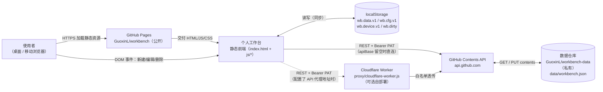
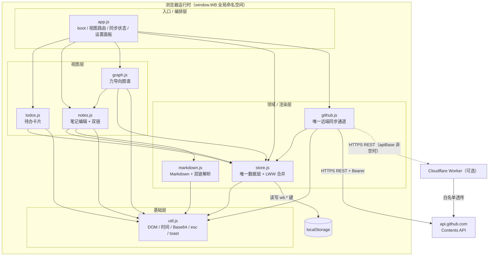
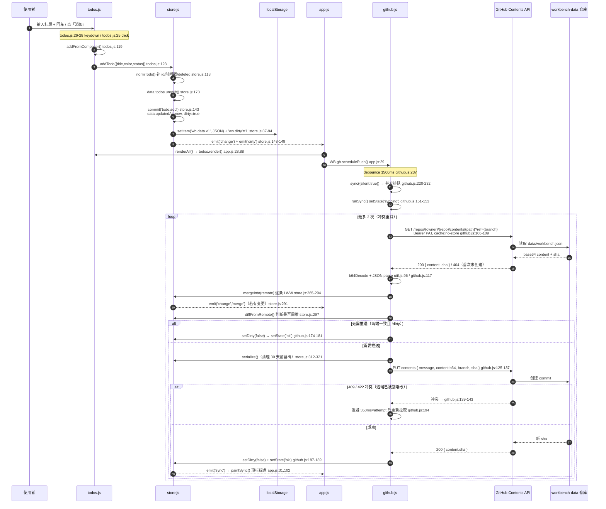
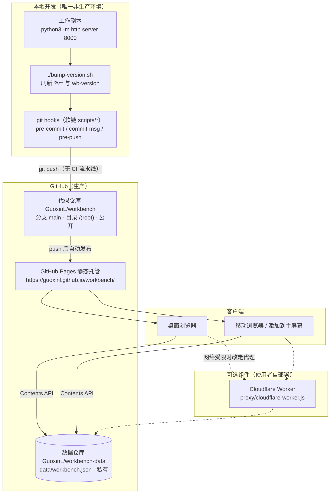

# 架构文档

> 维护者：Guoxin.Liu <lgx31@sina.cn> | 最后更新：2026-07-31
>
> Source: `index.html`（脚本加载顺序 = 模块依赖顺序）、`js/*.js`、`proxy/cloudflare-worker.js`、`bump-version.sh`、`README.md`
> Last-verified: 2026-07-31（对应 commit `cf46195`）

本文件面向人和 AI，描述系统结构、关键决策与已知技术债。AI 协作入口见 [AGENTS.md](../../AGENTS.md)。

---

## 1. 系统定位

一个**零后端的个人工作台 Web 应用**：待办卡片 + 双向链接笔记（`[[标题]]` 语法）+ 笔记关联图谱，数据以**单个 JSON 文件**存放在使用者自己的 GitHub 私有仓库中，多设备读写同一文件实现跨端同步。托管在 GitHub Pages，手机「添加到主屏幕」即可当 App 用。服务对象是**单个使用者本人**（自用工具，非多租户产品）。

**架构模式**：**纯客户端单体（Client-only Monolith）**

判定证据：

| 证据 | 事实 |
|------|------|
| 无服务端入口 | 全仓库无 `main.go` / `server.js` / `app.py`；唯一 HTML 入口 `index.html` |
| 无构建产物 | 无 `package.json` / `node_modules` / 打包器配置，`index.html:269-276` 直接 `<script src>` 引入源文件 |
| 无模块系统 | 8 个 JS 文件均为 IIFE 挂载到全局 `window.WB`（`js/util.js:4` 建根命名空间），**不是 ES Module**，加载顺序即依赖顺序 |
| 唯一"后端" | `proxy/cloudflare-worker.js`（106 行）仅为**可选**的 GitHub API 白名单透传代理，不含任何业务逻辑、不存储任何数据 |
| 持久化 | 浏览器 `localStorage` + GitHub Contents API 单文件读写，无数据库 |

代码规模（`wc -l`，3185 行）：`index.html` 278 / `css/style.css` 466 / `js/notes.js` 483 / `js/github.js` 375 / `js/store.js` 361 / `js/app.js` 292 / `js/todos.js` 286 / `js/markdown.js` 203 / `js/graph.js` 202 / `js/util.js` 133 / `proxy/cloudflare-worker.js` 106。

---

## 2. 系统上下文



| 外部系统/角色 | 交互方式 | 数据方向 | 说明 |
|-------------|---------|---------|------|
| 使用者 | 浏览器 DOM 事件 | 双向 | 唯一角色，无多用户/无管理员概念（自用工具） |
| GitHub Pages | HTTPS 静态托管 | 出（交付代码） | 部署**代码仓库** `GuoxinL/workbench`，必须公开；根目录 `.nojekyll` 关闭 Jekyll |
| GitHub Contents API | HTTPS REST，`Authorization: Bearer <PAT>` | 双向 | `GET /repos/{owner}/{repo}/contents/{path}?ref={branch}` 拉取、`PUT` 同路径推送（`js/github.js:48-52`） |
| 数据仓库 `workbench-data` | 经 Contents API 间接访问 | 双向 | 单文件 `data/workbench.json`；**必须私有**（README.md:59-60）；每次同步产生一次 commit |
| Cloudflare Worker 代理 | HTTPS REST | 双向（透传） | **可选**，仅在使用者网络访问不了 `api.github.com` 时启用；由使用者自行部署到自己账号 |
| localStorage | 同步 API | 双向 | 本地唯一持久化，兼作离线缓存与「本地模式」的完整存储 |

---

## 3. 服务/容器拓扑

本项目**只有一个可独立部署单元**（静态站点），外加一个可选的代理 Worker。下图展示的是**浏览器内的运行时模块拓扑**（等价于本项目的"服务拓扑"）：



| 服务/模块 | 代码位置 | 职责 | 通信方式 | 数据所有权 |
|----------|---------|------|---------|-----------|
| 静态站点 | 仓库根目录 | 唯一可部署单元，GitHub Pages 托管 | HTTPS 静态交付 | 无（无状态外壳） |
| `WB.util` | `js/util.js` | ID 生成、时间格式化、DOM 构造 `el()`、HTML 转义 `esc()`、UTF-8 安全 Base64、`debounce`、toast | 纯函数，被全体依赖 | 无 |
| `WB.store` | `js/store.js` | **唯一数据层**：todo/note CRUD、软删除墓碑、逐条 LWW 合并、序列化、事件广播 | 事件总线 `on/emit` | 拥有 `wb.data.v1`、`wb.cfg.v1`、`wb.device.v1`、`wb.dirty` 全部 localStorage 键 |
| `WB.gh` | `js/github.js` | **唯一远端通道**：拉取/合并/推送、sha 乐观锁、冲突重试、轮询、五步诊断 | HTTPS REST → Contents API | 拥有 `data/workbench.json` 的读写权 |
| `WB.md` | `js/markdown.js` | 手写 Markdown 渲染器 + `[[双链]]` 提取与上下文摘录 | 纯函数 | 无 |
| `WB.todos` | `js/todos.js` | 待办卡片列表、筛选/搜索、编辑抽屉、转笔记 | 调 `WB.store` | 无（视图态：`filterStatus`/`filterColor`/`keyword`/`editingId`） |
| `WB.notes` | `js/notes.js` | 笔记列表/详情、Markdown 实时预览、`[[` 自动补全、反链面板、改标题联动改引用 | 调 `WB.store` / `WB.md` | 无（视图态：`currentId`/`mode`/`suppressRender`） |
| `WB.graph` | `js/graph.js` | 零依赖力导向布局，SVG 渲染，拖拽/缩放/点击跳转 | 调 `WB.notes.buildGraph()` | 无（布局态：`nodes`/`edges`/`view`） |
| `WB.app` | `js/app.js` | 启动编排 `boot()`、视图路由、同步状态渲染、设置面板、示例数据播种 | 订阅 `store` 的 `change`/`sync` 事件 | 无（`wb.view`、`wb.seeded` 两个 UI 态键由本模块直写，见 §12） |
| 代理 Worker | `proxy/cloudflare-worker.js` | 路径白名单 + Origin 白名单 + CORS 头，透传到 `api.github.com` | HTTPS 反向代理 | **无状态、无存储、不记录令牌**（代码注释 `proxy/cloudflare-worker.js:72`） |

---

## 4. 核心模块内部结构

```
workbench/
├── index.html              ← 唯一页面：三视图（待办/笔记/图谱）+ 两个抽屉 + script 加载顺序
├── manifest.json           ← PWA 清单（仅「添加到主屏幕」，无 Service Worker，见 §12）
├── icon.svg / .nojekyll    ← 图标 / 关闭 GitHub Pages 的 Jekyll 处理
├── bump-version.sh         ← 发版脚本：刷新 index.html 中所有 ?v= 与 wb-version meta
├── css/style.css           ← 全部样式（含移动端适配，无预处理器）
├── js/
│   ├── util.js             ← L1 基础层：无任何内部依赖，建立 window.WB
│   ├── store.js            ← L2 数据层：localStorage 唯一出入口 + 合并算法
│   ├── github.js           ← L2 同步层：GitHub API 唯一出入口
│   ├── markdown.js         ← L2 渲染层：Markdown + 双链解析（纯函数）
│   ├── todos.js            ← L3 视图层
│   ├── notes.js            ← L3 视图层
│   ├── graph.js            ← L3 视图层
│   └── app.js              ← L4 入口层：启动编排与跨视图路由
├── proxy/cloudflare-worker.js  ← 可选 GitHub API 中转
└── scripts/                ← 本地 git 钩子实现（pre-commit / commit-msg / pre-push）
```

**模块间依赖规则**（由 `index.html:269-276` 的 `<script>` 顺序强制，无模块系统兜底）：

1. 加载顺序固定为 `util → store → github → markdown → todos → notes → graph → app`，**顺序即依赖顺序，不可调换**。每个文件顶部以 `const U = WB.util, S = WB.store` 形式在 IIFE 执行时立即捕获引用，前置模块未加载会直接 `undefined` 崩溃。
2. **单向分层**：L1 ← L2 ← L3 ← L4。低层禁止引用高层。
3. **两处受控的反向引用**（运行时惰性调用，非加载期捕获，因此不构成循环依赖）：
   - 视图层通过 `WB.app.openNote(id)` 做跨视图跳转（`js/todos.js:194`、`js/notes.js` 经列表点击、`js/graph.js:196`）；
   - `app.js` 通过 `WB.notes.flush()` 在同步/离开前强制落盘编辑器内容（`js/app.js:49`、`js/app.js:97`）。
4. **graph → notes 复用**：`js/graph.js:43` 直接调 `WB.notes.buildGraph()`，双链图构建逻辑只有一份（`js/notes.js:80`）。
5. **数据流单向广播**：任何写操作 → `store.commit()`（`js/store.js:143`）→ `emit('change')` → `app.js:27` 统一 `renderAll()` + 触发防抖推送。视图层**不互相调用渲染**。

---

## 5. 数据流（核心链路）

> 追踪场景：**使用者在输入框敲下一条待办并回车，直到内容落进 GitHub 仓库的 `data/workbench.json`**。



**同步的另外三条触发路径**（均汇入同一个 `sync()` 入口）：

| 触发源 | 代码位置 | 说明 |
|--------|---------|------|
| 定时轮询 | `js/github.js:240-249` | 默认 20s（可配 5–300s），`document.hidden` 时跳过 |
| 回到前台 / 网络恢复 | `js/app.js:44-47` | `visibilitychange` + `online` 事件，立即静默同步 |
| 手动点顶栏同步胶囊 | `js/app.js:95-99` | 先 `WB.notes.flush()` 落盘，再非静默同步并 toast |

**关键数据结构**：

- **`data`（根文档，`js/store.js:48`）**：`{ version:1, todos:[], notes:[], updatedAt:number }`，即 `data/workbench.json` 的完整形态。
- **`todo`（`js/store.js:113-126`）**：`{ id, title, desc, color(8色枚举), status('todo'|'doing'|'done'), due, noteId, createdAt, updatedAt, deleted }`。
- **`note`（`js/store.js:128-138`）**：`{ id, title, content(Markdown), fromTodo, createdAt, updatedAt, deleted }`。
- **`cfg`（`js/store.js:31-39`，仅存本地，永不上传）**：`{ enabled, repo, branch, path, token, poll, apiBase }`。
- **双链图（`js/notes.js:80-100`，运行时计算不落盘）**：`{ outMap, inMap, missing, byTitle, notes }`，由 `MD.extractLinks()` 扫全部笔记正文的 `[[标题]]` 现算，标题匹配走 `util.slug()`（trim + 小写 + 空白折叠）。

**合并语义（`js/store.js:265-294`）**：以记录 `id` 为主键，远端存在而本地没有 → 直接插入；两端都有 → 比较 `updatedAt`，**远端更新才覆盖本地**（逐条 last-write-wins）。合并粒度是**单条记录**而非整文件，因此两端同时编辑*不同*条目不会互相丢数据；同时编辑*同一*条目则较早的写入被丢弃——这是无后端方案的固有取舍（README.md:138）。删除走**软删除墓碑**（`deleted:true` + 刷新 `updatedAt`），保证删除动作能传播到其它设备，序列化时清理 30 天前的墓碑控制文件体积。

---

## 6. 服务通信

本项目**无服务间通信**（只有一个部署单元）。下表记录的是**浏览器 → 外部 HTTP 接口**与**模块间事件**两类通信。

### 6.1 对外 HTTP 调用

| 调用方 | 被调用方 | 协议 | 同步/异步 | 关键接口 |
|--------|---------|------|----------|---------|
| `js/github.js:106` `fetchRemote` | GitHub Contents API | HTTPS REST | 同步（await） | `GET /repos/{owner}/{repo}/contents/{path}?ref={branch}&t={ts}` |
| `js/github.js:125` `pushRemote` | GitHub Contents API | HTTPS REST | 同步（await） | `PUT /repos/{owner}/{repo}/contents/{path}`，body 含 `sha` 做乐观锁 |
| `js/github.js:261` `test` | GitHub Repos API | HTTPS REST | 同步 | `GET /repos/{owner}/{repo}`，校验 `permissions.push` |
| `js/github.js:321` `diagnose` | GitHub Rate Limit API | HTTPS REST | 同步 | `GET /rate_limit`，读 `x-oauth-scopes` 判定令牌范围 |
| `js/github.js:307` `diagnose` | API 根 | HTTPS | 同步 | `GET /`，纯连通性探测（不带 token） |
| Worker（可选） | `api.github.com` | HTTPS | 同步 | 白名单：`/rate_limit`、`/repos/{o}/{r}`、`/repos/{o}/{r}/contents/**`、`/`（`proxy/cloudflare-worker.js:20-25`） |

**通信约定**：

- 所有请求经统一封装 `req()`（`js/github.js:67-91`）：默认 **12s 超时**（`AbortController`），诊断步骤缩短为 10s。
- 固定请求头：`Authorization: Bearer <token>`、`Accept: application/vnd.github+json`、`X-GitHub-Api-Version: 2022-11-28`（`js/github.js:54-60`）。
- 请求根地址由 `API_BASE()`（`js/github.js:14-18`）决定：`cfg.apiBase` 非空则走代理，否则 `https://api.github.com`。
- 网络类错误统一中文化并标记 `err.net = true`；判定用 `e.name === 'TypeError'` 而非 `instanceof`，因 fetch 可能来自其它 realm（`js/github.js:80-81` 注释）。
- HTTP 状态码语义映射集中在 `readErr()`（`js/github.js:93-103`）：401→令牌失效、403+rate limit→频率超限、404→仓库/分支/权限问题。
- 无 traceID / 无请求链路标识（无后端，不适用）。

### 6.2 模块间事件（store 事件总线，`js/store.js:53-60`）

| 事件 | 发布方 | 订阅方 | 语义 |
|------|--------|--------|------|
| `change` | `store.commit()` / `store.mergeInto()` / `store.replaceAll()` | `app.js:27` | 数据已变更，触发全量重渲染 + 防抖推送 |
| `dirty` | `store.commit()` / `store.setDirty()` | 当前无独立订阅方（状态经 `sync` 事件间接体现，见 `app.js:110`） | 本地存在未推送变更 |
| `sync` | `github.setState()` | `app.js:31` `paintSync` | 同步状态机流转：`idle/syncing/ok/error/off` |
| `cfg` | `store.saveCfg()` | 当前无订阅方（`app.js:175` 直接命令式调 `restartPoll()`） | 配置已更新 |

---

## 7. 技术选型理由

| 选型 | 备选方案 | 选择原因（Why） | 约束条件 |
|------|---------|---------|---------|
| **零构建原生 JS + 全局 IIFE 命名空间** | React/Vue + Vite/Webpack；ES Module | README.md:3「纯静态页面，**无需后端、无需构建**」是项目的核心卖点：源码即产物，`git push` 后 GitHub Pages 立即生效，无流水线、无产物目录、无 lockfile 漂移。README.md:52 记录代码全用相对路径，**无需任何 base 配置**即可适配 Pages 的 `/workbench/` 子路径。选 IIFE 而非 ES Module，可让页面在 `file://` 直接打开时也不受模块 CORS 限制。 | 代价是加载顺序硬编码在 `index.html:269-276`；AGENTS.md 红线 2 明令**禁止**引入构建工具/框架/npm 依赖 |
| **GitHub 私有仓库 + 单 JSON 文件当"数据库"** | 自建后端 + PostgreSQL；Firebase/Supabase；纯本地 localStorage | ① 零运维零成本：使用者已有 GitHub 账号，无需再买服务器或注册第三方服务；② `index.html:216`「数据以单个 JSON 文件存放在你的仓库中，多端读写同一文件即可保持一致」——单文件让"跨端一致"退化成一次 GET/PUT，无需设计 API；③ README.md:166「每次改动会产生一次 commit，数据历史在仓库里可完整回溯」——白拿版本历史与误删恢复；④ 数据主权完全归使用者，代码仓库公开而数据仓库私有（README.md:59-60）。 | 单文件 = 全量读写，数据量增长后 payload 线性膨胀；写并发靠 sha 乐观锁；受 GitHub API 每小时 5000 次认证配额约束（README.md:110） |
| **localStorage 作本地唯一持久化** | IndexedDB；仅内存 | 数据结构就是一个小 JSON 文档，`getItem/setItem` 同步 API 足够，且能在同步未配置时直接降级成完整可用的「本地模式」（`js/github.js:222`）。 | 同步 API 会阻塞主线程；容量上限约 5MB；`js/store.js:91-93` 已对写入失败做 toast 兜底 |
| **可选 Cloudflare Worker 代理**（`apiBase` 配置项） | 公共 CORS 代理；后端中转；不支持 | README.md:115 记录了真实痛点：部分网络**根本连不上 `api.github.com`**，诊断会卡在「网络连通」步。代理必须做三件事（README.md:124）：转发 `Authorization` 头、补 CORS 响应头（否则浏览器拒收）、**限制只放行工作台用到的接口以防被当成公共代理滥用**。选 Worker 是因为免费额度足够、部署仅需粘贴一个文件（`proxy/cloudflare-worker.js:7-11` 注释「约 3 分钟」）。关键约束写在 `proxy/cloudflare-worker.js:5`：**令牌只经过你自己的 Worker，不流向任何第三方**。 | 代理能看到令牌明文，README.md:126 明确警告「务必只填自己部署的服务」；`workers.dev` 默认域名在部分网络同样受限，需绑自有域名 |
| **手写 Markdown 渲染器**（`js/markdown.js`，203 行） | marked / markdown-it + DOMPurify | 文件头注释 `js/markdown.js:3-4` 写明动机：「**不依赖任何第三方库，输出前统一转义，避免 XSS**」。零构建前提下引 CDN 库会增加外部依赖与首屏阻塞，且需额外引入 sanitizer；自写渲染器可在 `inline()` 入口先 `U.esc()` 再套规则（`js/markdown.js:45`），从源头保证转义。同时 `[[双链]]` 是本项目特有语法，通用库也需自行扩展。 | 只支持 README.md:144-153 列出的语法子集；嵌套/边界场景弱于成熟库 |
| **手写力导向布局**（`js/graph.js`，202 行） | d3-force / cytoscape.js | 文件头 `js/graph.js:2` 标注「**无依赖力导向布局**」。图谱规模是个人笔记量级（几十节点），斥力+引力+向心+阻尼的 260 帧模拟（`js/graph.js:86-125`）足够，引 d3 会让"零依赖"破功。 | O(n²) 全对斥力（`js/graph.js:88-99`），节点数大时性能下降 |
| **`?v=` 时间戳版本参数**（`bump-version.sh`） | Service Worker 缓存策略；文件名 hash | 零构建 = 没有打包器生成内容 hash。commit `81429d7` 消息即「静态资源加版本号**根治缓存旧代码**」，是为解决真实故障而引入；commit `cf46195` 又补了 `index.html:5-7` 三个防缓存 meta 双保险。 | 需人工执行；AGENTS.md 红线 3 把"改 js/css 未 bump 就发版"列为红线 |

---

## 8. 部署拓扑



| 环境 | 特点 | 配置来源 |
|------|------|---------|
| 本地开发 | `python3 -m http.server 8000` 起静态服务，浏览器刷新即验证；无编译步骤、无热更新 | 无配置文件；运行时配置在浏览器 localStorage `wb.cfg.v1` |
| **无 staging** | 不适用。项目为单人自用工具，无预发环境；生产验证靠 Pages 部署后直接刷新 | — |
| 生产（GitHub Pages） | 静态 CDN，无副本概念、无负载均衡、无扩缩容；`main` 分支 root 目录，`.nojekyll` 关闭 Jekyll | 同上，配置全在使用者浏览器本地；仓库内**不存在**任何环境配置文件 |
| 代理 Worker（可选） | Cloudflare 边缘无状态运行；由使用者部署到**自己**的账号 | 硬编码在 `proxy/cloudflare-worker.js`：`UPSTREAM`(17)、`ALLOW`(20-25)、`ALLOW_ORIGINS`(29-31) |

**发布流程**（`.harness/docs/devops/deployment.md` 为权威，此处仅记架构相关事实）：改码 → 浏览器刷新验证 → `./bump-version.sh` → `git commit`（本地钩子校验）→ `git push` → Pages 自动发布。

**无 CI/CD 流水线**：仓库内无 `.github/workflows/`、无 Dockerfile、无 K8s/Helm 清单。质量门禁**全部在本地 git 钩子**，通过软链安装（AGENTS.md）：

```
.git/hooks/pre-commit  -> ../../scripts/pre_commit_check.sh
.git/hooks/commit-msg  -> ../../scripts/commit_msg_check.sh
.git/hooks/pre-push    -> ../../scripts/pre_push_check.sh
```

---

## 9. 横切关注点

| 关注点 | 方案 | 关键文件/配置 |
|--------|------|-------------|
| 日志 | 仅浏览器 `console`：`console.warn` 用于本地数据/配置解析失败（`js/store.js:67,72`）、`console.error` 用于事件监听器异常（`js/store.js:58`）。**用户可见反馈**走 toast（`js/util.js:105-116`），分 `ok/err/info` 三档。**无远端日志采集、无日志级别开关、无结构化日志** | `js/util.js:105`、`js/store.js:58,67,72` |
| 链路追踪 | **不适用**。无后端、无跨服务调用，不存在 traceID 传播场景。替代能力是**五步同步诊断** `diagnose()`：配置检查 → 网络连通 → 令牌有效性 → 仓库访问与写权限 → 数据文件，逐步回调渲染并在失败处**中断并给出具体处置建议** | `js/github.js:284-368`、UI 在 `js/app.js:144-166` |
| 认证鉴权 | 应用**自身无登录态**（单机自用）。对 GitHub 的认证使用使用者的 Personal Access Token，以 `Authorization: Bearer` 发送；推荐细粒度令牌 + 仅授权数据仓库 + `Contents: Read and write`（README.md:66-75）。写权限在连接测试时前置校验 `permissions.push`（`js/github.js:265`、`js/github.js:342`） | `js/github.js:54-60,265,342` |
| 敏感数据处理 | Token 只存 localStorage `wb.cfg.v1`，**从不写入 `data/workbench.json`**（`serialize()` 只输出 `version/updatedAt/todos/notes`，`js/store.js:312-321`）、**从不打日志**、**从不硬编码**。设置面板输入框为 `type="password"`（`index.html:235`）。已知取舍：明文存于 localStorage，README.md:165 提示公共电脑用后清空 | `js/store.js:312`、`index.html:235`、AGENTS.md 红线 5 |
| XSS 防护 | 用户内容渲染前统一 `U.esc()` 转义 5 个字符（`js/util.js:60-64`）；`markdown.js` 在 `inline()` 第一行即整体转义再套规则（`js/markdown.js:45`）；图谱节点标题同样经 `U.esc()`（`js/graph.js:147`）；纯文本内容优先走 `el(...,{text})` 走 `textContent`（`js/util.js:50`） | `js/util.js:60`、`js/markdown.js:45`、`js/graph.js:147` |
| 代理侧安全 | 双白名单：**路径白名单** `ALLOW` 正则只放行 4 类接口（`proxy/cloudflare-worker.js:20-25`）+ **来源白名单** `ALLOW_ORIGINS`（默认仅 `https://guoxinl.github.io`，`proxy/cloudflare-worker.js:29-31`）；OPTIONS 预检单独返回 204；仅透传 4 个白名单请求头，Worker 自身不存储不记录令牌 | `proxy/cloudflare-worker.js:20-31,55-78` |
| 配置管理 | 单层：`DEFAULT_CFG`（`js/store.js:31-39`）↔ localStorage `wb.cfg.v1`。**空值回落**在两处双保险：加载时逐项回落（`js/store.js:74-77`）+ 同步引擎侧 `normCfg()` 再回落一次（`js/github.js:34-41`），对应 commit `253bc3b` / `6427394`。无配置中心、无环境变量、无配置文件 | `js/store.js:31-39,74-77`、`js/github.js:34-41` |
| 错误处理 | 分三层：① 网络层 `req()` 统一 12s 超时 + 网络错误中文化（`js/github.js:67-91`）；② 协议层 `readErr()` 按状态码映射人话（`js/github.js:93-103`）；③ 展示层 `setState('error')` 点亮红点 + 非静默时 toast（`js/github.js:201-206`）。**无统一错误码体系**（无跨服务契约需求） | `js/github.js:67-103,201-206` |
| 重试 / 降级 | **冲突重试**：PUT 遇 409/422 → 重新拉取合并后重试，最多 3 次，退避 `350ms × attempt`（`js/github.js:139-143,192-197`）。**并发排队**：静默调用复用进行中的 Promise，用户主动调用则排队等完再跑一次（`js/github.js:220-232`）。**降级**：`cfgValid()` 不通过即进入 `off` 本地模式，功能完整仅不同步（`js/github.js:222`、`js/app.js:184`） | `js/github.js:139,192,220`、`js/app.js:184` |
| 熔断 | **不适用**。单一外部依赖（GitHub API），失败即降级本地模式，无需熔断器。频率控制靠轮询间隔下限 5s / 上限 300s 的钳制（`js/github.js:244`）与推送侧 1.5s 防抖（`js/github.js:237`） | `js/github.js:237,244` |
| 数据一致性 | **最终一致性 + 逐条 LWW**。写路径无事务概念；`mergeInto()` 以 `id` 为主键按 `updatedAt` 取新（`js/store.js:265-294`）；删除用墓碑传播（`js/store.js:186-192,222-232`）；提交用 `sha` 乐观锁防丢写。已知取舍：同一条记录被两端同时改，较早写入被丢弃（README.md:138） | `js/store.js:265,312`、`js/github.js:131` |
| 离场保护 | `beforeunload` 时先 `WB.notes.flush()` 强制落盘编辑器内容，若 `dirty` 未推送则弹原生确认框拦截（`js/app.js:48-55`）；笔记编辑器 700ms 防抖自动保存 + 失焦/切笔记时 `flushNow()`（`js/notes.js:18,61,145`） | `js/app.js:48`、`js/notes.js:18` |
| 可观测性（指标） | **不适用**。无指标采集、无 APM、无埋点。唯一"运行状态"是顶栏同步胶囊的四态指示（同步中/已同步/待同步/同步失败，`js/app.js:102-118`） | `js/app.js:102` |
| 自动化测试 | **当前缺失**，见 §12 技术债。仓库无任何测试文件、无测试框架、无覆盖率工具 | — |

---

## 10. 核心设计决策

| # | 决策 | Why | 影响范围 | 日期 |
|---|------|-----|---------|------|
| 1 | 用 GitHub 私有仓库的单个 JSON 文件当数据后端，前端纯静态托管在 Pages | 零后端、零运维、零成本；使用者完全掌握数据主权；白拿 commit 历史做版本回溯 | 全局架构；决定了后续所有同步/合并设计 | 2026-07（commit `628ea38`） |
| 2 | 逐条记录 LWW 合并，而非整文件覆盖 | 整文件覆盖会让两端并发编辑**不同条目**时互相丢数据；按 `id` + `updatedAt` 逐条取新可把冲突面收敛到"同一条记录"（README.md:134） | `js/store.js:265-294`（`mergeInto`）、`js/store.js:297-309`（`diffFromRemote`） | 2026-07（commit `628ea38`） |
| 3 | 删除采用软删除墓碑，30 天后在序列化时清理 | 硬删除在多端场景下会被其它设备的旧数据"复活"；墓碑保证删除动作可传播。设 30 天上限是为控制单文件体积（README.md:136） | `js/store.js:186-192,222-232,312-321` | 2026-07（commit `628ea38`） |
| 4 | 提交带 `sha` 做乐观锁，冲突（409/422）时重新拉取合并后重试，上限 3 次 | GitHub Contents API 的 PUT 本身要求 `sha` 匹配，天然提供 CAS；重试而非报错可让"两端几乎同时提交"这类高频场景自愈 | `js/github.js:125-148,156-199` | 2026-07（commit `628ea38`） |
| 5 | 同步入口改为**并发排队**：静默调用复用进行中的 Promise，用户主动调用排队后重跑 | 原实现检测到"正忙"直接 `return false`，调用方把"忙"误判成"失败"。轮询每 5s 触发、单次耗时可达 2s+，手动点同步撞上轮询是大概率事件，于是出现"网络正常却报同步失败"（`js/github.js:209-219` 完整记录了这段归因） | `js/github.js:220-234`；调用方判定改为 `!== false`（`js/app.js:98,180`） | 2026-07（commit `81429d7`） |
| 6 | "两端已一致、无需推送"必须返回真值对象而非 `merged` 布尔 | 早期返回 `merged`（可能为 `false`），让**成功的空同步**被上层误报成失败（`js/github.js:178-180` 注释原文记录） | `js/github.js:181` | 2026-07（commit `81429d7`） |
| 7 | 全部静态资源加 `?v=<时间戳>` 版本参数，由 `bump-version.sh` 统一刷新 | 零构建没有内容 hash，浏览器命中旧缓存会导致"线上表现与仓库代码不一致"，排障极其困难。commit 消息原文即「静态资源加版本号**根治**缓存旧代码」 | `index.html:14,269-276`、`bump-version.sh`；AGENTS.md 红线 3 | 2026-07（commit `81429d7`） |
| 8 | 增加可配置 `apiBase` + 随仓附带 Cloudflare Worker 代理脚本 | 部分网络访问不了 `api.github.com`，此前用户只能看到笼统的"同步失败"。同期引入五步诊断把失败拆成可定位的步骤，并把网络错误中文化 | `js/github.js:14-18,284-368`、`proxy/cloudflare-worker.js`、`index.html:237-243` | 2026-07（commit `963e6f0`） |
| 9 | 仓库/分支/路径允许留空，在**加载侧与引擎侧双重回落**默认值 | 旧版本可能把空字符串写进 localStorage 盖掉默认值，导致同步指向空仓库；单点回落不足以覆盖"配置已被污染"的历史数据（`js/store.js:74` 注释原文） | `js/store.js:74-77`、`js/github.js:34-41` | 2026-07（commit `253bc3b`、`6427394`） |
| 10 | 笔记改标题时自动重写其它笔记中的 `[[旧标题]]` 引用 | 双链以**标题**（而非 id）为寻址键，不联动改写会导致改名即断链 | `js/notes.js:264-304`（`renameRefs`，包在 `S.batch()` 里只触发一次同步） | 2026-07（commit `628ea38`） |
| 11 | 引入 `store.batch()` 批量修改包装 | 批量写（如 `renameRefs` 一次改多篇笔记）若每条都 `commit()`，会触发 N 次全量重渲染与 N 次推送调度 | `js/store.js:141-161` | 2026-07（commit `628ea38`） |

---

## 11. 不变式与硬性约束

> 任何代码变更都**不得违反**以下规则（前 5 条为 AGENTS.md 明列红线）：

- **禁止引入构建工具 / 前端框架 / npm 依赖**（含 `package.json`、打包器、CDN 引入大型框架）。破坏"零构建直出 GitHub Pages"的部署模型，项目将失去可直接托管性。
- **改动任何 js/css 后、提交前必须执行 `./bump-version.sh`**。否则浏览器命中旧缓存，线上行为与仓库代码不一致（已有前科，见 §10 决策 7）。
- **禁止绕过 `store.js` 直接读写 `wb.*` localStorage 键**。绕开会导致脏标记、LWW 合并、事件广播全部失效，引发同步竞态与数据丢失。
- **禁止绕过 `github.js` 直接调 GitHub Contents API**。同步状态机、乐观锁、冲突重试、并发排队都在这一层。
- **令牌禁止以任何形式落库（`data/workbench.json`）、落日志或写入源码**。数据/代码仓库可能公开，Token 泄漏等于交出 GitHub 账户写权限。
- **`index.html` 中 8 个 `<script>` 的加载顺序不可调整**（`util → store → github → markdown → todos → notes → graph → app`）。无模块系统兜底，顺序错误 = 运行时 `undefined` 崩溃。
- **新增持久化字段必须同时改三处**：`normTodo()`/`normNote()` 补默认值（`js/store.js:113,128`）、确认 `mergeInto()` 的 LWW 语义对该字段成立（`js/store.js:265`）、确认 `serialize()` 不会把它漏掉或误带敏感信息（`js/store.js:312`）。
- **任何写操作必须最终走 `store.commit()`**，由它统一刷新 `updatedAt`、置 `dirty`、落盘、广播 `change`。直接改 `data` 而不 commit 的修改不会被同步。
- **用户内容渲染前必须经 `util.esc()` 转义**，禁止把未转义内容拼进 `innerHTML`。
- **Worker 代理只做 GitHub API 白名单透传**，新增转发路径必须先加进 `ALLOW`（`proxy/cloudflare-worker.js:20`），禁止开放任意 URL 中转。
- **删除记录只能软删除**（置 `deleted:true` + 刷新 `updatedAt`），禁止从数组中 `splice`，否则删除动作无法传播到其它设备。
- **同步失败判定必须用 `!== false`**，不能用真值判断——`sync()` 成功时可能返回对象也可能返回 `true`（见 §12 技术债）。

---

## 12. 已知技术债

| 严重度 | 债务描述 | 证据位置 | 风险 | 偿还计划 |
|--------|---------|---------|------|---------|
| 🔴 高 | **完全没有自动化测试**。核心的 LWW 合并、墓碑清理、冲突重试、Markdown 渲染均为纯函数，极易测试却零覆盖 | 全仓库无测试文件；`.harness/docs/unittest/unittest.md` 仍为模板 | 合并算法一旦回归会**静默丢数据**，且因是多端异步场景，人工很难复现 | <!-- TODO(sop.init): 待与维护者确认是否引入零依赖测试方案（如浏览器内跑的断言页），需同时满足"禁止引入 npm 依赖"红线 --> |
| 🔴 高 | **`bump-version.sh` 使用 BSD sed 语法，在 Linux/WSL 上直接报错**。`sed -i ''` 的空串参数只有 macOS/BSD sed 接受 | `bump-version.sh:8,10` | 在 Linux 环境开发时脚本失败 → 版本号未刷新 → 直接踩中 AGENTS.md 红线 3（浏览器缓存旧代码） | 改为兼容写法（先探测 sed 变体，或用 `perl -pi -e` 统一） |
| 🟡 中 | **`sync()` 返回值类型不一致**：无需推送时返回对象 `{merged, pushed:false}`，推送成功返回 `true`，失败返回 `false` | `js/github.js:181`（对象）、`js/github.js:190`（`true`）、`js/github.js:205`（`false`） | 调用方必须记住用 `ok !== false` 判定（`js/app.js:98,180`），任何人改用真值判断都会引入 §10 决策 6 修过的那个 bug | 统一为 `{ok:boolean, merged, pushed}` 结构，同步改两处调用方 |
| 🟡 中 | **`deviceId` 生成、持久化并对外暴露，但全项目无任何消费方**。合并算法只看 `updatedAt`，不区分设备 | `js/store.js:12,44,79-83,353`（定义与暴露）；`grep deviceId` 全仓库仅命中 store.js 自身 | 死代码误导后来者以为存在设备维度的冲突处理；也占用一个 localStorage 键 | 二选一：接入合并逻辑（如同一毫秒的 `updatedAt` 用 deviceId 做确定性 tie-break），或直接删除 |
| 🟡 中 | **有 `manifest.json` 但无 Service Worker**，「PWA」实际只有"添加到主屏幕"能力，**离线完全不可用** | `manifest.json` 存在；全仓库 grep 无 `serviceWorker` / `sw.js` 注册 | 移动端断网时打开主屏图标是白屏，而本应用的数据本就全在 localStorage、离线可用性是天然优势，白白浪费 | 需先解决与 `?v=` 缓存刷新策略的冲突（SW 缓存 + 手动版本号双机制易打架） |
| 🟡 中 | **全局命名空间 + `<script>` 顺序耦合**，无模块系统。依赖关系靠 `index.html:269-276` 的行序隐式维护 | `js/util.js:4`（建 `window.WB`）、`index.html:269-276` | 新增模块或调整顺序时无任何静态检查，错误只在运行时暴露；也无法做 tree-shaking / 按需加载 | 受 AGENTS.md 红线 2 约束不能引构建工具；可考虑改 ES Module + `type="module"`（但会丢失 `file://` 直开能力，需权衡） |
| 🟢 低 | **每次数据变更都全量重渲染**：待办列表 `board.innerHTML=''` 后重建全部卡片；笔记列表、反链面板、图谱指纹同理 | `js/todos.js:149-163`、`js/notes.js:114`、`js/notes.js:204` | 数据量达到数百条时会出现可感知的卡顿与滚动位置丢失；当前个人使用量级尚未暴露 | 数据量增长后再做增量 diff 渲染，不提前优化 |
| 🟢 低 | **图谱力导向为 O(n²) 全对斥力计算**，每帧遍历所有节点对，共 260 帧 | `js/graph.js:88-99,124` | 笔记数上百后布局阶段掉帧 | 需要时改 Barnes-Hut 四叉树近似 |
| 🟢 低 | **图谱 SVG 通过字符串拼接 + `innerHTML` 整体重绘**，每帧重建整棵 SVG 子树 | `js/graph.js:133-155` | 性能开销大于增量更新；标题虽已 `U.esc()`，但字符串拼 DOM 的模式本身脆弱 | 改为复用 SVG 元素、只更新 `transform` 属性 |
| 🟢 低 | **`app.js` 绕过 `store.js` 直接读写 2 个 localStorage 键**（`wb.view`、`wb.seeded`，共 4 处调用） | `js/app.js:22,24,73,79` | 严格说与"localStorage 只经 store 读写"的不变式相悖；这几个是纯 UI 态、不参与同步，实际风险低，但破坏了规则的一致性 | 收敛到 `store` 提供的 UI 态读写接口，或在不变式中显式豁免这两个键 |
| 🟢 低 | **`store` 的 `dirty` / `cfg` 事件已发布但无订阅方** | `js/store.js:99,149`（emit）；全仓库无对应 `on('dirty')` / `on('cfg')` | 死接口，容易让人误以为存在响应式配置更新（实际 `app.js:175` 是命令式调 `restartPoll()`） | 接入或移除 |
| 🟢 低 | **`.harness/docs/` 下多份文档仍为未填写的模板**（`failures.md` 等），架构文档引用它们时缺乏落点 | `.harness/docs/failures.md:33-40` 仍是 `{{填写}}` 占位 | 历史故障的归因（如缓存旧代码事件）散落在 commit message 里，没有沉淀 | 把 commit `81429d7` / `cf46195` 对应的两次缓存故障补录进 `failures.md` |

---

## 13. 演进路线（可选）

<!-- TODO(sop.init): 维护者未在 README / AGENTS.md / commit 历史 / issue 中留下任何路线图或计划性表述，无从推断。以下仅为「§12 技术债偿还」的自然排序，不代表维护者的实际优先级，需确认后再作数。 -->

- **近期**：修复 `bump-version.sh` 的 BSD/GNU sed 兼容问题（🔴，直接关联发版红线）；统一 `sync()` 返回值类型（🟡，消除踩坑点）。
- **中期**：为 `store.mergeInto` / `diffFromRemote` / `serialize` / `markdown.render` 这批纯函数补测试（🔴，需先确定不违反"禁 npm 依赖"红线的测试方案）；处置 `deviceId` 死代码。
- **远期**：<!-- TODO(sop.init): 是否补 Service Worker 做离线、是否迁移 ES Module，均涉及与现有零构建/缓存刷新模型的取舍，需维护者拍板 -->
