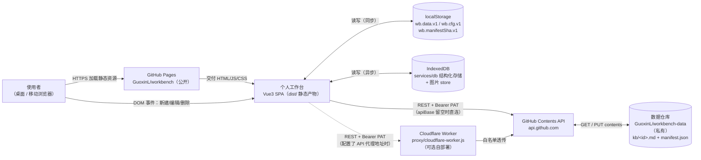
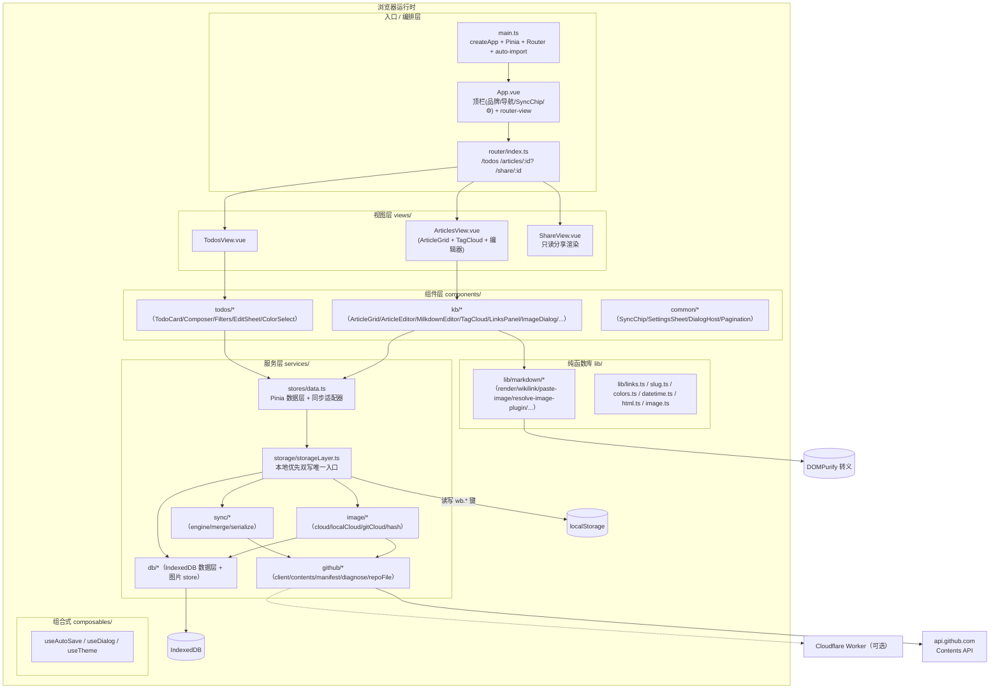
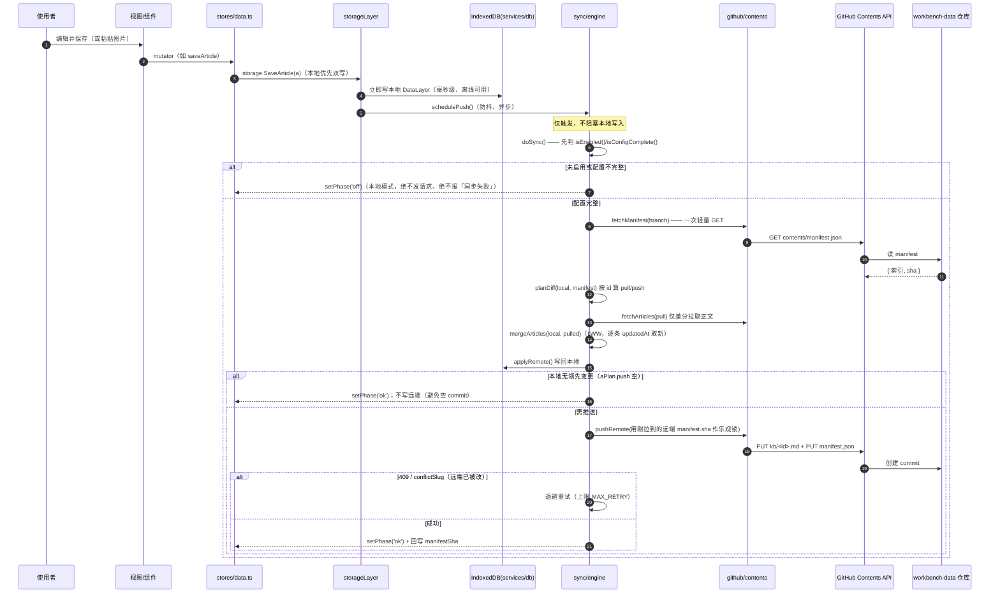
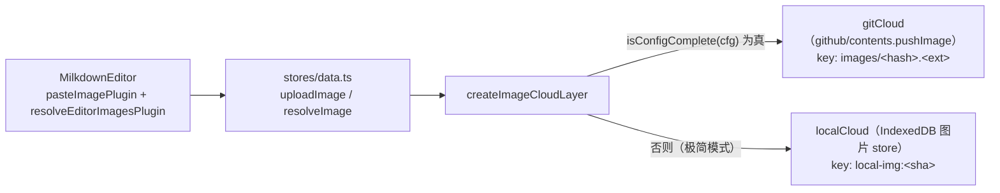
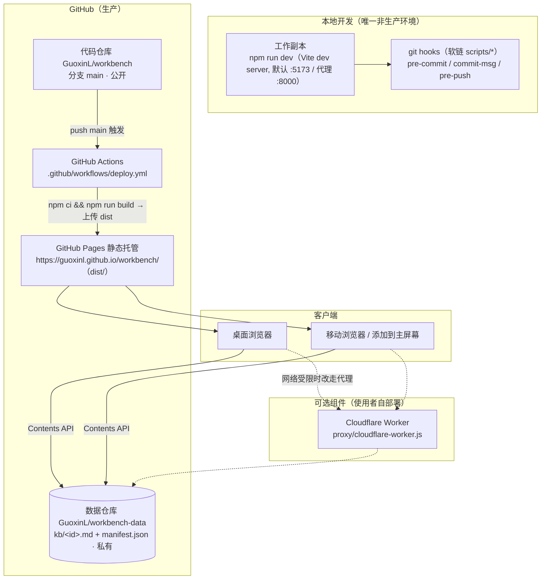

# 架构文档

> 维护者：Guoxin.Liu <lgx31@sina.cn> | 最后更新：2026-08-04
>
> Source：当前代码库（Vue3 + Vite + TypeScript + Pinia 标准构建流水线，2026-07-31 重构后）。
> 本文件优先以**磁盘上真实代码**为准；若与 AGENTS.md 冲突，以本文件描述的代码结构为准、以 AGENTS.md 的红线/SOP 为准。
> 上一次整体对齐：2026-07-31（重构评审批准引入 Vite + Vue3 + Pinia，原「零构建原生 JS」架构已作废）。

本文件面向人和 AI，描述系统结构、关键决策与已知技术债。AI 协作入口见 [AGENTS.md](../../AGENTS.md)。

---

## 1. 系统定位

一个**纯客户端单体（Client-only Monolith）个人工作台 Web 应用**：待办卡片 + 双向链接笔记（`[[标题]]` 语法）+ 文章内关系图谱，数据以**结构化文档**存放在使用者自己的 GitHub 仓库中，多设备经 GitHub Contents API 读写同一份数据实现跨端同步。托管在 GitHub Pages，手机「添加到主屏幕」即可当 App 用。服务对象是**单个使用者本人**（自用工具，非多租户产品）。

**架构模式**：**纯客户端单体 + 可选边缘代理**

判定证据：

| 证据 | 事实 |
|------|------|
| 无服务端业务逻辑 | 全仓库无 `server.js` / `main.go`；唯一「后端」是可选 Cloudflare Worker 代理（`proxy/cloudflare-worker.js`），只做 GitHub API 白名单透传，不含业务逻辑、不存储数据 |
| 标准构建流水线 | 有 `package.json` / `node_modules` / `vite.config.ts`；`npm run build` = `vue-tsc --noEmit && vite build`，产物为 `dist/`（带内容 hash 的 `assets/index-*.js`） |
| 模块化 | ES Module + Vue SFC；`src/` 下按 `stores / services / views / components / lib / composables / router` 分层（详见 §3） |
| 持久化 | 浏览器 **localStorage（`wb.data.v1` 即时加载层）+ IndexedDB（结构化存储层 `services/db`）** 双重本地存储；远端经 GitHub Contents API 同步到 `kb/<id>.md` + `manifest.json` |

代码规模（`.harness/docs/`、`scripts/`、`proxy/` 之外的应用代码，约 60+ 个 `.ts`/`.vue` 文件）：入口 `src/main.ts`、`src/App.vue`；状态层 `src/stores/data.ts`；服务层 `src/services/**`；视图 `src/views/*`；组件 `src/components/**`；纯函数库 `src/lib/**`；组合式 `src/composables/**`。

---

## 2. 系统上下文



| 外部系统/角色 | 交互方式 | 数据方向 | 说明 |
|-------------|---------|---------|------|
| 使用者 | 浏览器 DOM 事件 | 双向 | 唯一角色，无多用户/无管理员概念（自用工具） |
| GitHub Pages | HTTPS 静态托管 | 出（交付代码） | 部署**代码仓库** `GuoxinL/workbench`，必须公开；构建产物 `dist/` 经 GitHub Actions 上传，`.nojekyll` 关闭 Jekyll |
| GitHub Contents API | HTTPS REST，`Authorization: Bearer <PAT>` | 双向 | `GET /repos/{owner}/{repo}/contents/manifest.json?ref={branch}` 拉轻量索引；`GET/PUT /repos/{owner}/{repo}/contents/kb/{id}.md` 按 id 差分读写正文；`PUT .../images/{hash}.{ext}` 推送图片（图云同步模式） |
| 数据仓库 `workbench-data` | 经 Contents API 间接访问 | 双向 | 文章正文 `kb/<id>.md`（带 frontmatter）+ 轻量索引 `manifest.json`；**必须私有**；每次推送产生一次 commit |
| Cloudflare Worker 代理 | HTTPS REST | 双向（透传） | **可选**，仅在使用者网络访问不了 `api.github.com` 时启用；由使用者自行部署到自己账号 |
| localStorage | 同步 API | 双向 | `wb.data.v1` 即时加载层（零配置启动契约）；`wb.cfg.v1` 配置（含令牌）；`wb.manifestSha.v1` manifest 乐观锁 sha |
| IndexedDB | 异步 API | 双向 | `services/db` 结构化存储（单实体 + 分页索引）+ 图片 store（图云极简模式） |

> ⚠️ **与旧架构的关键差异**：早期版本把整份数据塞进单一 `data/workbench.json` 并靠 `bump-version.sh` 刷新 `?v=` 参数破缓存。现重构为：**远端按文章拆分成 `kb/<id>.md` + 轻量 `manifest.json` 索引**；**缓存由 Vite 产物内容 hash 保证**，已无 `bump-version.sh`。本文件与 AGENTS.md 概述段若仍出现 `data/workbench.json` / `bump-version.sh` 字样，一律以本段为准。

---

## 3. 模块分层（改代码前先认清入口）



### 3.1 目录结构与职责

```
workbench/
├── index.html              ← Vite 入口（含 <div id="app">）
├── vite.config.ts          ← 构建 + Vitest 配置（base:'./'、alias @、auto-import）
├── package.json            ← scripts: dev / build / preview / test / test:watch / type-check
├── tsconfig*.json         ← TS 严格模式 + vue-tsc
├── src/
│   ├── main.ts             ← 应用引导：挂载 Pinia、Router、Element Plus
│   ├── App.vue             ← 应用外壳：顶栏（品牌 / 导航 / SyncChip / ⚙ 设置）/ router-view
│   ├── router/index.ts     ← 路由表（hash 模式）：/todos · /articles/:id? · /share/:id
│   ├── types/index.ts      ← 全局类型（Todo / Article / Config / Manifest / SyncPhase ...）
│   ├── stores/
│   │   └── data.ts         ← ★ 唯一 Pinia 数据层：内存快照 + 迁移 + 图云层接入 + 同步适配器
│   ├── services/
│   │   ├── db/             ← IndexedDB 数据层（indexeddb / schema / types），含图片 store
│   │   ├── storage/
│   │   │   └── storageLayer.ts   ← ★ 本地优先双写唯一入口（local-first：先写 IDB 再触发同步）
│   │   ├── github/         ← ★ 唯一远端同步通道（client / contents / manifest / diagnose / repoFile）
│   │   ├── sync/           ← ★ 同步引擎（engine / merge / serialize）：守卫 / 差分 / LWW / 冲突重试
│   │   └── image/          ← 图云层（cloud / localCloud / gitCloud / hash / index）：极简↔同步路由
│   ├── lib/
│   │   ├── markdown/       ← Markdown 渲染、双链解析、paste-image、resolve-image-plugin、frontmatter、excerpt、scan-wikilinks、serialize
│   │   ├── links.ts / slug.ts / colors.ts / datetime.ts / html.ts / image.ts
│   ├── composables/        ← useAutoSave / useDialog / useTheme
│   ├── views/              ← TodosView / ArticlesView / ShareView
│   ├── components/
│   │   ├── common/         ← SyncChip / SettingsSheet / DialogHost / Pagination
│   │   ├── todos/          ← TodoCard / TodoComposer / TodoFilters / TodoEditSheet / ColorSelect
│   │   └── kb/             ← ArticleGrid / ArticleEditor / MilkdownEditor / TagCloud / LinksPanel / ImageDialog / LinkDialog / WikiAutocomplete / ...
│   └── test/setup.ts       ← Vitest 全局 setup（fake-indexeddb + Pinia 激活）
├── proxy/cloudflare-worker.js  ← 可选 GitHub API 中转（路径 + 来源白名单）
├── .github/workflows/deploy.yml ← GitHub Actions 部署（push main → build → 上传 dist → Pages）
└── scripts/                ← 本地 git 钩子实现（pre-commit / commit-msg / pre-push）
```

### 3.2 分层依赖规则

1. **单向分层**：`L4 → L3 → L2 → L1`，低层禁止引用高层。`stores/data.ts` 经 `services/storage` 收口写操作，视图/组件只调 `store` 与 `lib`，不直接碰 `wb.*` 或 GitHub API（红线 4）。
2. **唯一写入口**：所有实体变更（Todo / Article）的持久化与同步触发收敛到 `storageLayer.ts`（见 §5）。组件不得自行 `localStorage.setItem('wb.data.v1', …)` 或直连 Contents API。
3. **纯函数库 `lib/` 无副作用**：Markdown / 双链 / slug 等只做转换，便于 Vitest 单测。
4. **同步引擎是唯一远端通道**：`services/sync` 调度 `services/github/contents`，视图层只通过 store 的 `schedulePush()` 间接触发。

---

## 4. 核心数据结构

- **`Config`（`src/types`）**：`{ enabled, repo, branch, token, poll, apiBase, publicRepo? }`。仅存 localStorage `wb.cfg.v1`，**永不写入远端数据、永不打日志、永不硬编码**（红线 5）。
- **`WorkbenchData` / 内存快照（`stores/data.ts`）**：`{ version:1, todos:[], articles:[], updatedAt }`，对应 `wb.data.v1`。
- **`Todo`**：`{ id, title, desc?, color, status('todo'|'doing'|'done'), due?, articleId?, time, createdAt, updatedAt, deleted }`（软删墓碑）。
- **`Article`**：`{ id, title, content(Markdown), tags:[], fromTodo?, createdAt, updatedAt, deleted }`；远端 `kb/<id>.md` 以 frontmatter 承载 `title/tags/...`，正文为 Markdown。
- **`Manifest`**：轻量索引 `{ articles: {id:{updatedAt,sha}}, todos?: {id:{updatedAt,sha}}, updatedAt }`，对应远端 `manifest.json`；`wb.manifestSha.v1` 存其乐观锁 sha。
- **图云键**：
  - 极简模式（IndexCloudLayer via IndexedDB）：`local-img:<sha>`，`resolve` 时转 object URL；
  - 同步模式（gitCloud）：`images/<hash>.<ext>`，`resolve` 时由调用方按 `config` 拼 `raw.githubusercontent.com` 直链（见 `ShareView`、`lib/markdown` 的 `resolveImage` 约定）。
- **双链图**：运行时由 `lib/links.ts` + `lib/markdown/scan-wikilinks.ts` 扫全部文章正文 `[[标题]]` 现算（按 slug 匹配），不落盘；文章内 `LinksPanel` 组件渲染关系图（SVG）。

---

## 5. 数据流（核心链路）

> 追踪场景：**使用者在编辑器敲下内容并保存，直到它落进 GitHub 数据仓库的 `kb/<id>.md` 并经 `manifest.json` 索引**。



**同步的其它触发路径**（均汇入 `engine.sync()`，含并发排队）：

| 触发源 | 位置 | 说明 |
|--------|------|------|
| 防抖调度 | `engine.schedulePush()` | 写操作后防抖触发（`storageLayer` 调用） |
| 定时轮询 | `engine` 内 `setInterval`（间隔 `cfg.poll`，默认 5s，钳制 5–300s） | `document.hidden` 时跳过 |
| 回到前台 / 网络恢复 | store 订阅 `visibilitychange` + `online` | 立即静默同步 |
| 手动点顶栏同步胶囊 | `SyncChip` | 非静默同步 + toast |

**并发排队**：`sync()` 复用进行中的 `inFlight` Promise，而非「忙就 return false」——避免把「正忙」误判成「失败」（见 §10 决策）。

**合并语义**：以 `id` 为主键，远端存在本地没有 → 插入；两端都有 → 比较 `updatedAt`，**远端更新才覆盖本地**（逐条 LWW，`sync/merge.ts`）。删除走**软删除墓碑**（`deleted:true` + 刷新 `updatedAt`），保证删除动作能传播到其它设备；`sync/serialize.ts` 的 `cleanupTombstones` 清理过期墓碑控制体积。

---

## 6. 服务通信

本项目**无服务间通信**（只有一个部署单元 + 可选代理 Worker）。下表记录**浏览器 → 外部 HTTP** 与**模块间调用**两类。

### 6.1 对外 HTTP 调用（GitHub Contents API）

| 调用方 | 被调用方 | 关键接口 |
|--------|---------|---------|
| `github/contents.fetchManifest` | Contents API | `GET /repos/{o}/{r}/contents/manifest.json?ref={branch}` |
| `github/contents.fetchArticles/fetchTodos` | Contents API | `GET /repos/{o}/{r}/contents/kb/{id}.md`（按差分 id 列表） |
| `github/contents.pushRemote` | Contents API | `PUT .../kb/{id}.md` + `PUT .../manifest.json`（带 sha 乐观锁） |
| `github/contents.pushImage` | Contents API | `PUT /repos/{o}/{r}/contents/images/{hash}.{ext}`（图云同步模式，返回 `images/<hash>.<ext>` 键） |
| `github/diagnose.testConnection` | Repos API | `GET /repos/{o}/{r}` 校验 `permissions.push`；超时 12s |
| `github/diagnose.runDiagnose` | 多步 | 配置检查 → 网络连通 → 令牌有效性 → 仓库写权限 → 数据文件（+ 可选公开库） |
| Worker（可选） | `api.github.com` | 白名单：`/rate_limit`、`/repos/{o}/{r}`、`/repos/{o}/{r}/contents/**`、`/`（见 `proxy/cloudflare-worker.js`） |

**通信约定**（对齐 `github/diagnose.ts` 与 `contents.ts`）：

- 统一封装带 **12s 超时**（`AbortController`）；代理地址非空时走 `cfg.apiBase`，否则 `https://api.github.com`。
- 固定头：`Authorization: Bearer <token>`、`Accept: application/vnd.github+json`。
- 配置**不完整**（`isConfigComplete` 为假）时，`testConnection` 直接返回 `{ok:false, code:'config', message:'配置不完整：请填写 owner/repo（格式 owner/repo）、分支与令牌'}`，**不发起任何网络请求、不报「同步失败」**（回归红线，见 §9 / verification.md §7）。
- HTTP 状态语义映射：401→令牌失效、403/429→频率超限、404→仓库/分支/权限问题；网络错误区分「代理不可达 / CORS」与「直连不可达」给出可操作提示。
- 无 traceID（无后端，不适用）。

### 6.2 模块间关键调用

| 调用 | 说明 |
|------|------|
| 视图/组件 → `stores/data.ts` | 经 Pinia `useDataStore()` 读状态、调 mutator |
| `stores/data.ts` → `storage/storageLayer` | mutator 内部收口双写 |
| `storageLayer` → `services/db`（IndexedDB） | 立即本地落盘 |
| `storageLayer` → `sync/engine.schedulePush` | 触发异步远端同步 |
| `storageLayer` → `image`（图云层） | 保存时把内嵌 `data:` 临时图替换为引用 key + 孤儿回收 |
| `sync/engine` → `github/contents` | 拉/推/合并 |
| `lib/markdown.render` → DOMPurify | 用户内容渲染前转义，防 XSS |

---

## 7. 图云层（Image Cloud，P2 ⑥）

编辑器粘贴/拖拽图片时，由 `stores/data.ts` 暴露的 `uploadImage(blob)` / `resolveImage(key)` 接入，内部经 `services/image/index.ts` 的 `createImageCloudLayer` 在**极简 / 同步**两支间路由：



- **路由判定**：每次调用按最新 `cfg` 实时判定（`isConfigComplete`），用户中途填好配置即从极简无缝切到同步模式。
- **极简模式**：图片存 IndexedDB 图片 store，`key = local-img:<sha>`，`resolve` 转 object URL，仅本地可用（不跨端）。
- **同步模式**：图片推到 git 分支 `images/<hash>.<ext>`，`key = images/<hash>.<ext>`；`ShareView` 与 `lib/markdown` 的 `resolveImage` 按 `config.repo/branch` 拼 `raw.githubusercontent.com` 直链渲染。
- **编辑器接线**：`MilkdownEditor.vue` 挂载 `pasteImagePlugin({upload})` 把粘贴图经 `store.uploadImage` 转 key，并挂 `resolveEditorImagesPlugin(resolve)` 在编辑态把 key 解析回可显示源；`ShareView.vue` 在只读渲染时把 git key 改写为 raw 直链。
- **存储隔离**：图云层是图片存储的**唯一隔离面**，视图/组件不直接碰 IndexedDB 图片 store 或 Contents API 的图片路径（红线 4 延伸）。

---

## 8. 部署拓扑



| 环境 | 特点 | 配置来源 |
|------|------|---------|
| 本地开发 | `npm run dev` 起 Vite 开发服务器（热更新）；`npm test` 跑 Vitest；`npm run build` 做类型检查 + 构建 | 无环境配置文件；运行时配置在浏览器 localStorage `wb.cfg.v1` |
| **无 staging** | 不适用。项目为单人自用工具，无预发环境；生产验证靠 Pages 部署后直接刷新 | — |
| 生产（GitHub Pages） | 静态 CDN，由 GitHub Actions 从 `dist/` 发布；`base:'./'` 相对路径适配 `/workbench/` 子路径；**缓存由 Vite 产物内容 hash 保证，无需手工 bump 版本** | 同上，配置全在使用者浏览器本地 |
| 代理 Worker（可选） | Cloudflare 边缘无状态运行；由使用者部署到**自己**的账号 | 硬编码在 `proxy/cloudflare-worker.js`：`UPSTREAM` / `ALLOW`（路径白名单）/ `ALLOW_ORIGINS`（来源白名单） |

**发布流程**（`.harness/docs/devops/deployment.md` 为权威）：改码 → `npm run build` 通过（含 `vue-tsc` 类型检查）→ `npm test` 全绿 → `git commit`（本地钩子校验）→ `git push` → GitHub Actions 自动构建并发布到 Pages。**无手工 bump 版本步骤。**

**质量门禁**：① 本地 git 钩子（`scripts/*` 软链，见 AGENTS.md）；② CI（`deploy.yml`）再次执行类型检查 + 测试 + 构建。

---

## 9. 横切关注点

| 关注点 | 方案 | 关键文件 |
|--------|------|---------|
| 日志 | 仅浏览器 `console`（`warn`/`error` 用于解析失败/异常）；**用户可见反馈**走 Element Plus 消息/弹层。无远端日志采集、无日志级别开关、无结构化日志 | `stores/*`、`services/*` |
| 链路追踪 | **不适用**。替代能力是**五步同步诊断** `runDiagnose()`：配置检查 → 网络连通 → 令牌有效性 → 仓库写权限 → 数据文件，逐步给出处置建议 | `github/diagnose.ts` |
| 认证鉴权 | 应用**自身无登录态**（单机自用）。对 GitHub 用使用者 PAT（`Authorization: Bearer`）；推荐细粒度令牌 + 仅授权数据仓库 + `Contents: Read and write`。写权限在连接测试时前置校验 `permissions.push` | `github/diagnose.ts` |
| 敏感数据处理 | Token 只存 localStorage `wb.cfg.v1`，**从不写入远端数据 / 落日志 / 硬编码**（红线 5）。设置面板输入框 `type="password"` | `stores/data.ts`、`common/SettingsSheet.vue`、AGENTS.md 红线 5 |
| XSS 防护 | 用户内容渲染前经 `lib/markdown` + **DOMPurify** 转义（`src/lib/markdown` 遵循）；禁止把未转义内容拼进 `innerHTML`；`lib/html.ts` 的 `esc()` 用于纯文本兜底 | `lib/markdown/*`、`lib/html.ts`、AGENTS.md 安全基线 2 |
| 代理侧安全 | 双白名单：路径白名单（只放行 4 类接口）+ 来源白名单（默认仅 `https://guoxinl.github.io`）；仅透传必要请求头，Worker 自身不存储不记录令牌 | `proxy/cloudflare-worker.js` |
| 配置管理 | 单层：`wb.cfg.v1` ↔ 默认值；`isConfigComplete()` 在诊断/引擎两处守卫。无配置中心、无环境变量 | `stores/data.ts`、`github/diagnose.ts` |
| 错误处理 | 分三层：网络层（12s 超时 + 中文化）→ 协议层（按状态码映射人话）→ 展示层（SyncChip 四态：本地模式/同步中/已同步/同步失败）。**无统一错误码体系** | `github/diagnose.ts`、`sync/engine.ts`、`common/SyncChip.vue` |
| 重试 / 降级 | **冲突重试**：PUT 遇 409 / `conflictSlug` → 用刚拉到的远端 sha 重拉合并后重试，上限 `MAX_RETRY`，退避 `RETRY_BACKOFF×attempt`。**并发排队**：复用 inFlight。降级：`isEnabled()/isConfigComplete()` 不通过即 `off` 本地模式，功能完整仅不同步 | `sync/engine.ts` |
| 熔断 | **不适用**。单一外部依赖，失败即降级本地模式；频率靠轮询间隔钳制 + 推送防抖 | `sync/engine.ts` |
| 数据一致性 | **最终一致性 + 逐条 LWW** + 软删墓碑 + `sha` 乐观锁。取舍：同一条记录被两端同时改，较早写入被丢弃 | `sync/merge.ts`、`sync/serialize.ts` |
| 可观测性（指标） | **不适用**。唯一"运行状态"是 `SyncChip` 四态指示 | `common/SyncChip.vue` |
| 自动化测试 | **Vitest4 + jsdom + fake-indexeddb + @vue/test-utils**；`src/**/*.test.ts` 与 `proxy/**/*.test.ts`；`src/test/setup.ts` 全局 setup。三段式规范见 `unittest/unittest.md` | `vite.config.ts`、`src/test/setup.ts` |

---

## 10. 核心设计决策

| # | 决策 | Why | 影响范围 | 日期 |
|---|------|-----|---------|------|
| 1 | 用 GitHub 私有仓库承载数据，前端纯静态托管在 Pages | 零后端、零运维；使用者完全掌握数据主权；白拿 commit 历史做版本回溯 | 全局架构 | 2026-07 |
| 2 | 远端按文章拆分为 `kb/<id>.md` + 轻量 `manifest.json` 索引（取代旧单文件 `data/workbench.json`） | 单文件全量读写 payload 随数据量线性膨胀；索引驱动可"按 id 差分"只拉改动过的正文，降低配额消耗与冲突面 | `github/contents.ts`、`sync/engine.ts` | 2026-07-31 重构 |
| 3 | 逐条记录 LWW 合并，而非整文件覆盖 | 整文件覆盖会让两端并发编辑**不同条目**时互相丢数据；按 `id` + `updatedAt` 逐条取新收敛冲突面 | `sync/merge.ts` | 2026-07 |
| 4 | 删除采用软删除墓碑，过期在序列化时清理 | 硬删除在多端场景会被旧数据"复活"；墓碑保证删除动作可传播 | `sync/serialize.ts` | 2026-07 |
| 5 | 提交带 `sha` 做乐观锁，冲突（409 / conflictSlug）重拉合并重试 | Contents API 的 PUT 天然要求 sha 匹配（CAS）；重试而非报错可让"两端几乎同时提交"自愈 | `sync/engine.ts`、`github/contents.ts` | 2026-07 |
| 6 | `sync()` 并发排队：复用 inFlight Promise，而非"忙就 return false" | 早期把"正忙"误判成"失败"，导致"网络正常却报同步失败" | `sync/engine.ts` | 2026-07（commit `81429d7` 精神延续） |
| 7 | 配置不完整时 `testConnection`/`doSync` 直接 `off`、**不发请求、不误报同步失败** | 空 repo / 缺令牌若发起请求会 404 并误报；回归红线要求默认全新浏览器即为「本地模式」 | `github/diagnose.ts`、`sync/engine.ts` | 2026-07 |
| 8 | 本地优先双写：`storageLayer` 先写 IndexedDB 再异步触发同步 | 离线可用、写入毫秒级返回；同步失败只降级不影响本地 | `storage/storageLayer.ts` | 2026-07-31 重构 |
| 9 | 引入可配置 `apiBase` + 随仓附带 Cloudflare Worker 代理脚本 | 部分网络访问不了 `api.github.com`；五步诊断把失败拆成可定位步骤并中文化 | `github/diagnose.ts`、`proxy/cloudflare-worker.js` | 2026-07 |
| 10 | 笔记改标题时自动重写其它笔记中的 `[[旧标题]]` 引用 | 双链以**标题**（而非 id）为寻址键，不联动改写会导致改名即断链 | `lib/links.ts`（`renameRefs`） | 2026-07 |
| 11 | 图云层按 `isConfigComplete` 在极简（IndexedDB）/ 同步（git images/）间路由 | 未配置 GitHub 也能本地用图；配置好后无缝切到跨端同步 | `services/image/*` | 2026-07-31（P2 ⑥） |
| 12 | 构建产物内容 hash 取代 `?v=` 版本参数 / `bump-version.sh` | Vite 自动产出 `assets/index-<hash>.js`，缓存失效由构建机制保证，无需手工 bump | `vite.config.ts` | 2026-07-31 重构 |

---

## 11. 不变式与硬性约束

> 任何代码变更都**不得违反**以下规则（前 5 条为 AGENTS.md 明列红线，已随 2026-07-31 重构更新）：

- **禁止绕过 `src/stores/data.ts` 直接读写 `wb.*` localStorage 键**，或绕过 `src/services/github/*` / `src/services/sync/*` 直接调 GitHub Contents API。（红线 4）——绕开会失效脏标记、冲突合并、事件广播，引发同步竞态与数据丢失。
- **令牌禁止以任何形式落库（`kb/*.md` / `data/workbench.json` / `wb.cfg.v1` 以外的任何位置）、落日志或写入源码**。（红线 5）——数据/代码仓库可能公开，Token 泄漏等于交出 GitHub 账户写权限。
- **所有实体写操作必须最终走 `storageLayer` / store 的 mutator**，由它统一刷新 `updatedAt`、置脏标记、落盘、触发同步。直接改快照而不经 mutator 的修改不会被同步。
- **用户内容渲染前必须经转义**（`lib/markdown` 经 DOMPurify；纯文本走 `lib/html.esc()`），禁止把未转义内容拼进 `innerHTML`。
- **Worker 代理只做 GitHub API 白名单透传**，新增转发路径必须先加进 `ALLOW`，禁止开放任意 URL 中转。
- **删除记录只能软删除**（置 `deleted:true` + 刷新 `updatedAt`），禁止从数组中 `splice`，否则删除动作无法传播到其它设备。
- **新增持久化字段必须同时考虑双向合并逻辑**：确认 `mergeArticles/mergeTodos` 的 LWW 语义对该字段成立、`serialize`/`cleanupTombstones` 不会漏掉或误带敏感信息。
- **同步失败判定必须区分 `off`（未配置/未启用，非错误）与真实 `error`**：配置不完整只置 `off` + 友好提示，绝不置 `error` / 显示「同步失败」。

---

## 12. 已知技术债

| 严重度 | 债务描述 | 证据位置 | 风险 | 偿还计划 |
|--------|---------|---------|------|---------|
| 🟡 中 | **`d3-force` 在 `package.json` 依赖中但源码未引用**（grep 全仓无 `d3-force`/`d3Force` 使用） | `package.json:21` | 死依赖，增加安装体积；可能当初计划做力导向图谱但未落地 | 删除依赖，或补一个真正使用它的图谱视图 |
| 🟡 中 | **「图谱」视图未实现**：验证手册 §2/§5 描述的独立「图谱（标签气泡）」路由不存在；实际仅文章内 `LinksPanel` 渲染双链关系图 | `src/router/index.ts`（仅 `/todos` `/articles/:id?` `/share/:id`）；无 `GraphView.vue` | 文档/手册与代码不一致，易误导 | 实现 `GraphView` 并接入 `d3-force`，或把 verification.md §2/§5 改为描述 `LinksPanel` 关系图 |
| 🟡 中 | **`/settings` 不是路由**：设置是 `common/SettingsSheet.vue` 抽屉（⚙ 触发），但文档/手册偶有「进入 #/settings」表述 | `src/router/index.ts`、`src/components/common/SettingsSheet.vue` | 导航描述误导 | 文档统一为「点 ⚙ 打开设置抽屉」 |
| 🟢 低 | **`/share/:id` 只读分享**依赖 `raw.githubusercontent.com` 直链拉 `kb/<id>.md`，公开库场景需 `publicRepo` 配置 | `src/views/ShareView.vue`、`github/diagnose.ts:defaultPublicRepo` | 私有库分享需额外配置；未配置时分享可能 404 | 文档补充分享前提 |
| 🟢 低 | **每次数据变更全量重渲染**风险（Vue 响应式 + 列表重建），数据量达数百条时可感知卡顿 | `components/kb/*`、`components/todos/*` | 个人使用量级尚未暴露 | 数据量增长后再做增量 diff |

---

## 13. 演进路线（可选）

- **近期**：处置 `d3-force` 死依赖与「图谱视图未实现」的文档/代码不一致（🟡）；统一设置入口表述（路由 vs 抽屉）。
- **中期**：为 `sync/merge` / `serialize` / `lib/markdown` 这批纯函数补边界测试（已有 Vitest 基建与 `src/**/*.test.ts` 范例）；完善图云在同步/极简切换下的孤儿回收测试。
- **远期**：是否补 Service Worker 做离线 PWA、是否实现独立图谱视图（接 `d3-force`），需维护者拍板。

---

## 14. 相关文档索引

| 想了解什么 | 文档位置 |
|-----------|---------|
| 上下游 / 集成方关系（GitHub API / Cloudflare Worker 代理） | `.harness/docs/relationship.md` |
| 术语表（双链 / 脏标记 / 冲突合并 / 图云 / 极简↔同步 / kb/*.md / manifest.json / IndexedDB） | `.harness/docs/glossary.md` |
| 历史故障与教训 | `.harness/docs/failures.md` |
| 接口文档总索引 / 编写规范 / 模板 | `.harness/docs/apis/index.md`、`api-standards.md`、`_template.md` |
| 单元测试规范（环境 / 生成 / 运行调试，三段式） | `.harness/docs/unittest/unittest.md` |
| 集成测试规范（环境 / 用例 / 运行调试，三段式） | `.harness/docs/integration_test/integration_test.md` |
| 功能验证手册（每次改动后的自然语言核验流程） | `.harness/docs/verification.md` |
| 本地环境搭建与启动 | `.harness/docs/devops/env.md` |
| 日常开发流程（改码 → 构建验证 → 测试 → 提交） | `.harness/docs/devops/development.md` |
| GitHub Pages 部署 / Worker 代理部署 | `.harness/docs/devops/deployment.md` |
| 测试环境部署 / 代码同步 | `.harness/docs/devops/test-env-deploy.md` |
| 编码规范（行长 / 复杂度 / 命名 / 安全编码） | `.harness/docs/coding-style.md` |
| 团队人工 Code Review 流程与合入门槛 | `.harness/docs/code-review.md` |
| 日志规范（级别 / 必打场景 / 脱敏） | `.harness/docs/logging.md` |
