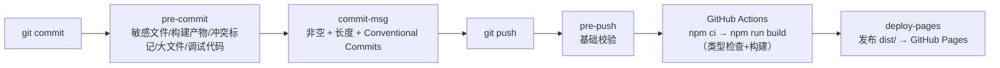

# 本地开发环境规范

> 状态：已定稿（2026-08-04 对齐 Vue3 + Vite + TS + Pinia 重构后） | 维护者：Guoxin.Liu <lgx31@sina.cn>
>
> Source（以磁盘真实代码为准）：`package.json`、`vite.config.ts`、`tsconfig*.json`、`.github/workflows/deploy.yml`、`scripts/*.sh`
> Last-verified: 2026-08-04

## 范围

新人跑通本项目的最低要求，以及日常「改码 → 构建/测试验证 → 提交 → 推送发布」的完整循环。

环境细节（配置项清单、FAQ）见 [env.md](env.md)；发布见 [deployment.md](deployment.md)。

## 系统要求

| 项目 | 要求 |
|------|------|
| 操作系统 | macOS / Linux / Windows + WSL2 均可 |
| Node | ≥ 20（CI 用 Node 24）；现代浏览器（需 ESM / `fetch` / `AbortController`） |
| 包管理器 | npm（随 Node）或 yarn（仓库 `packageManager` 声明 `yarn@1.22`，CI 用 `npm ci`） |

> 重构后项目是标准前端工程，**需要 Node 运行时与依赖安装**（早期「零依赖零构建」模型已作废，对应 AGENTS.md 红线 2/3 已移除）。

## 必装依赖

```bash
git --version        # 版本管理 + 发布
node --version       # ≥ 20
npm --version        # 或 yarn --version
npm install          # 或 corepack enable && yarn install —— 安装 devDependencies（Vite/Vue/vitest 等）
```

**版本一致性**：构建产物由 Vite 生成内容 hash，本地 `npm run dev` 与 CI 构建使用同一套源码与依赖，不存在"本地能跑线上跑不了"的构建期差异。类型检查在 `npm run build` 时由 `vue-tsc` 统一执行。

## 仓库初始化

```bash
git clone git@github.com:GuoxinL/workbench.git
cd workbench
npm install

# 安装本地 git 钩子（一次性；质量门禁之一）
ln -sf ../../scripts/pre_commit_check.sh .git/hooks/pre-commit
ln -sf ../../scripts/commit_msg_check.sh .git/hooks/commit-msg
ln -sf ../../scripts/pre_push_check.sh   .git/hooks/pre-push

ls -l .git/hooks/pre-commit .git/hooks/commit-msg .git/hooks/pre-push
```

## 一键运行

```bash
npm run dev          # Vite dev server，默认 http://localhost:5173
```

浏览器打开 **http://localhost:5173/**。改完源码后 Vite **HMR 热更新**自动刷新；`npm run build` 时做 `vue-tsc` 类型检查。

## 日常开发循环

```
1. 起服务：npm run dev（开发时持续运行，HMR 自动刷新）
2. 改代码（src/**/*.ts、src/**/*.vue、proxy/*）
3. 浏览器验证：http://localhost:5173 交互核验
4. 提交前门禁：
   - npm run type-check   # vue-tsc 类型检查零错误
   - npm test             # vitest 全绿
   - npm run build        # 构建通过（含类型检查 + 产出 dist/）
5. git add -A && git commit && git push
6. CI（GitHub Actions，push 到 main 触发）跑类型检查 + 构建，并自动发布到 GitHub Pages
```

> ⚠️ 缓存由 Vite 产物内容 hash 保证，**无需手工 bump 版本**（旧 `bump-version.sh` 已随重构移除）。改任何源码后重新 `npm run build` 即产出带新 hash 的产物。

## 本地自检命令

| 目的 | 命令 | 说明 |
|------|------|------|
| 类型检查 | `npm run type-check` | `vue-tsc --noEmit`，零错误才允许提交 |
| 运行测试 | `npm test`（`= vitest run`） | 全量单测；`npm run test:watch` 监听 |
| 构建 | `npm run build` | `vue-tsc --noEmit && vite build` → `dist/` |
| 令牌泄漏自查 | `grep -rn -E 'gh[pousr]_[A-Za-z0-9]{16,}\|github_pat_' src proxy` | 唯一允许命中是指令输入框 placeholder；任何其它命中即令牌落码，违反红线 5 |
| 资源可达性 | `curl -s -o /dev/null -w "%{http_code}\n" http://localhost:5173/` | 起 dev server 后跑，期望 200 |

> 测试用 Vitest，环境为 jsdom + fake-indexeddb（`vite.config.ts` `test.setupFiles` 指向 `src/test/setup.ts`）。新增纯函数优先补单测（见 [unittest/unittest.md](../unittest/unittest.md)）。

## IDE 推荐配置

- 任意编辑器（VS Code / IntelliJ / Vim），建议安装 Vue + TypeScript 支持。
- 类型与导入由 Vite / `vue-tsc` 驱动；可加 ESLint（非强制）。`src/auto-imports.d.ts` / `src/components.d.ts` 由 `unplugin-auto-import` / `unplugin-vue-components` 自动生成，勿手改。
- 格式约定见 [coding-style.md](../coding-style.md)。

## 调试

- **调试入口**：浏览器 DevTools（Vite 提供 HMR + sourcemap）。
- **状态查看**：Vue DevTools → Pinia → `stores/data` store，查看 `todos` / `articles` / `cfg`。
- **日志位置**：无日志文件。浏览器 Console（`console.warn` / `console.error`）+ Element Plus 消息/弹层，详见 [logging.md](../logging.md)。
- **同步排障**：设置抽屉（⚙）→ 诊断，五步定位（配置检查 → 网络连通 → 令牌有效性 → 仓库写权限 → 数据文件）。
- ⚠️ 调试时**禁止**整体打印 `store.cfg`——其中 `token` 是明文 PAT。

## 常见问题（FAQ）

- **Q: `npm run dev` 报端口被占 / EADDRINUSE？**
  A: `npm run dev -- --port 8080` 换端口；或 `lsof -i:5173` 查占用进程。

- **Q: 改了代码浏览器没反应？**
  A: Vite HMR 偶发失效或强缓存。DevTools → Network 勾 Disable cache，硬刷 `Ctrl/Cmd + Shift + R`，或重启 dev server。

- **Q: `npm run build` 类型错误？**
  A: 按 `vue-tsc` 报错修类型；CI 同样会因类型错误拦截发布。

- **Q: 数据库连不上 / 依赖服务起不来？**
  A: 不适用——本项目**无数据库、无后端**。同步未配置时自动降级为纯本地模式（`sync/engine.ts` `isEnabled()` / `isConfigComplete()` 守卫），功能完整只是不同步。

- **Q: `git commit` 被拦，提示 commit message 格式不对？**
  A: `commit-msg` 钩子校验非空 + 长度 + Conventional Commits 格式（`<type>(<scope>)?: <subject>`）。按提示修正格式即可。

- **Q: 页面白屏 / `Failed to resolve module`？**
  A: 依赖未安装或 `node_modules` 损坏——`rm -rf node_modules && npm install`；或确认用 `npm run dev` 而非直接托管源码（`file://` 不支持 ESM）。

更多踩坑见 [failures.md](../failures.md)。

## CI/CD 与交付

### CI/CD 流水线

**本项目接入 GitHub Actions**（`.github/workflows/deploy.yml`）：`push` 到 `main` 触发，依次 `npm ci` → `npm run build`（含 `vue-tsc` 类型检查）→ 上传 `dist/` 为 Pages artifact → `deploy-pages` 发布。



> 质量门禁分布：本地 git 钩子做基础校验；CI 做类型检查 + 构建并发布。**测试目前由本地 `npm test` 保证**（CI 工作流未自动跑测试，提交前务必本地跑绿）。逃生口：`SKIP_PRE_COMMIT=1` / `SKIP_PRE_PUSH=1`（应急用）。

### 交付制品

制品是 GitHub Actions 构建出的 `dist/`（带内容 hash 的 `assets/index-*.js` / `*.css`），由 Pages 托管。版本标识即 git commit，缓存失效由产物 hash 保证，无手工版本号。详见 [deployment.md](deployment.md)。

## 参考

- AI 协作入口：[../../../AGENTS.md](../../../AGENTS.md)
- 架构文档：[../architecture.md](../architecture.md)
- 环境与配置项清单：[env.md](env.md)
- 发布与运行：[deployment.md](deployment.md)
