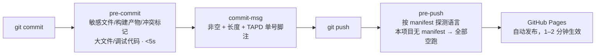

# 本地开发环境规范

> 状态：已定稿 | 维护者：Guoxin.Liu <lgx31@sina.cn> | 最后更新：2026-07-31
>
> Source: `README.md`、`index.html`、`bump-version.sh`、`scripts/*.sh`、`.git/hooks/`
> Last-verified: 2026-07-31（本页命令已在 WSL2 / Ubuntu + Python 3.12.3 + GNU sed 4.9 + git 实跑）

## 范围

新人跑通本项目的最低要求，以及日常「改码 → 刷新验证 → 刷版本号 → 提交」的完整循环。所有命令均已实跑验证。

环境细节（配置项清单、FAQ）见 [env.md](env.md)；发布见 [deployment.md](deployment.md)。

## 系统要求

| 项目 | 要求 |
|------|------|
| 操作系统 | macOS / Linux / Windows + WSL2 均可（注意 `bump-version.sh` 的 sed 差异，见下） |
| 内存 / 磁盘 | 无特殊要求（仓库 < 1MB，无依赖、无镜像、无产物） |
| 浏览器 | Chrome / Edge / Safari 现代版本（需 `fetch` / `AbortController` / ES2017+） |

## 必装依赖

```bash
# 1. 语言运行时 —— 无。本项目没有语言运行时，浏览器即运行时。
#    无 package.json / node_modules / lockfile / 虚拟环境。

# 2. 数据库 / 中间件 —— 无。数据在浏览器 localStorage + GitHub 上的一个 JSON 文件。

# 3. 开发工具 —— 只要 git 和一个静态服务器
git --version        # 版本管理 + 发布（push 即上线）
python3 --version    # 起本地静态服务，用系统自带的 http.server 即可
```

**版本一致性**：本项目**不锁定任何语言/工具版本**——源码不经任何转换直接交付给浏览器，本地跑的字节和 Pages 上线的字节完全一致，不存在"本地能跑线上跑不了"的构建期差异。唯一的环境差异点是 `bump-version.sh` 的 BSD/GNU sed 兼容问题（见下）。

> ⚠️ **红线 2**：严禁引入构建工具 / 前端框架 / npm 依赖（含 `package.json`、打包器、CDN 大型框架）。这会破坏"零构建直出 GitHub Pages"的部署模型。开发机上装了 `node` 也只能当**可选的语法自检工具**使用。

## 仓库初始化

```bash
git clone git@github.com:GuoxinL/workbench.git
cd workbench

# 安装本地 git 钩子（一次性；仓库无 CI，质量门禁全在这三个钩子上）
ln -sf ../../scripts/pre_commit_check.sh .git/hooks/pre-commit
ln -sf ../../scripts/commit_msg_check.sh .git/hooks/commit-msg
ln -sf ../../scripts/pre_push_check.sh   .git/hooks/pre-push

# 确认软链已生效
ls -l .git/hooks/pre-commit .git/hooks/commit-msg .git/hooks/pre-push
```

**无依赖安装、无代码生成、无数据库初始化步骤**——clone 完即可运行。

## 一键运行

```bash
python3 -m http.server 8000 --bind 127.0.0.1
```

预期输出：

```
Serving HTTP at 127.0.0.1 port 8000 (http://127.0.0.1:8000/) ...
```

浏览器打开 **http://127.0.0.1:8000/**。**改完 js/css 直接刷新页面即可**，无编译、无热更进程、无需重启服务。

## 日常开发循环

```
1. 起服务：python3 -m http.server 8000 --bind 127.0.0.1
2. 改代码（js/*.js、css/style.css、index.html）
3. 浏览器强刷验证：Ctrl/Cmd + Shift + R（避开 ?v= 强缓存）
4. 【改了 js/css 就必须做】刷新静态资源版本号（见下节）
5. git add -A && git commit && git push
6. 等 1–2 分钟，访问 https://guoxinl.github.io/workbench/ 核对页面 <meta name="wb-version">
```

### 版本号刷新（提交前强制）

`bump-version.sh` 做两件事：把 `index.html` 中所有 `.js?v=` / `.css?v=` 参数、以及 `<meta name="wb-version">` 一起替换成 `YYYYmmdd-HHMM` 时间戳。零构建没有内容 hash，这是**唯一**的缓存刷新手段。

**macOS / BSD sed 环境**：

```bash
./bump-version.sh
```

**Linux / WSL（GNU sed）环境**：脚本会失败（见下方 FAQ），改用等效命令（已实跑验证）：

```bash
V="$(date +%Y%m%d-%H%M)"
sed -i -E "s/(\.(js|css))\?v=[0-9A-Za-z-]+/\1?v=$V/g" index.html
sed -i -E "s/(name=\"wb-version\" content=\")[^\"]+/\1$V/" index.html
echo "版本号已更新为 $V"
```

**校验（两种环境通用）**——所有 `?v=` 与 meta 必须收敛到同一个值，输出应只有一行：

```bash
grep -o 'v=[0-9]\{8\}-[0-9]\{4\}' index.html | sort -u
```

> ⚠️ **红线 3**：改动 js/css 后未刷版本号就发版 = 浏览器命中旧缓存，线上行为与仓库代码不一致，排障极其困难（已有前科，见 [failures.md](../failures.md)）。

## 可选的本地自检命令

本项目**没有 lint / 测试 / 编译**（`make`、`npm run`、`pytest` 之类命令一概不存在）。以下是不引入任何项目依赖、可选执行的静态自检（均已实跑）：

| 目的 | 命令 | 说明 |
|------|------|------|
| JS 语法检查 | `for f in js/*.js proxy/cloudflare-worker.js; do node --check "$f" \|\| echo "FAIL $f"; done` | 需本机有 node；**仅作检查用途，不写入仓库任何依赖** |
| manifest 合法性 | `python3 -m json.tool manifest.json > /dev/null && echo OK` | PWA 清单 JSON 校验 |
| 版本号一致性 | `grep -o 'v=[0-9]\{8\}-[0-9]\{4\}' index.html \| sort -u` | 输出多于一行说明漏刷 |
| script 加载顺序 | `grep -n '<script src=' index.html` | 必须是 `util → store → github → markdown → todos → notes → graph → app`，顺序即依赖顺序 |
| 令牌泄漏自查 | `grep -rn -E 'gh[pousr]_[A-Za-z0-9]{16,}\|github_pat_' --include='*.js' --include='*.html' --include='*.json' .` | 唯一允许命中的是 `index.html:235` 的输入框 placeholder（`github_pat_… 或 ghp_…`）；出现**任何其它**命中即为令牌落码，违反红线 5 |
| 资源可达性 | `curl -s -o /dev/null -w "%{http_code}\n" http://127.0.0.1:8000/js/app.js` | 起服务后跑，期望 200 |

## IDE 推荐配置

- 任意编辑器均可（IntelliJ IDEA / VS Code / Vim），项目内 `.idea/` 已存在但**不影响**其它编辑器使用。
- 无需装语言插件、无需 language server 配置；建议开启 HTML/CSS/JS 基础语法高亮即可。
- 无 `.editorconfig` / `.eslintrc` / `.prettierrc`——格式约定见 [coding-style.md](../coding-style.md)，靠人工与 Review 保证。

## 调试

- **调试入口**：浏览器 DevTools（无 IDE Run/Debug 配置、无远程调试端口）。
- **全局对象**：Console 里 `WB.store` / `WB.gh` / `WB.md` / `WB.notes` / `WB.graph` / `WB.app` 均可直接调用，例如 `WB.gh.sync()` 手动触发同步。
- **日志位置**：无日志文件。浏览器 Console（`console.warn` / `console.error`）+ 页面 toast，详见 [logging.md](../logging.md)。
- **同步排障**：设置面板 → **诊断**，五步定位（配置检查 → 网络连通 → 令牌有效性 → 仓库访问 → 数据文件）。
- ⚠️ 调试时**禁止**整体打印 `WB.store.cfg`——其中 `token` 是明文 PAT。

## 常见问题（FAQ）

- **Q: `./bump-version.sh` 报 `sed: can't read s/(\.(js|css))\?v=...`，退出码 2？**
  A: 脚本用的是 BSD sed 语法 `sed -i ''`（`bump-version.sh:8,10`），GNU sed 不接受那个空串参数。改用上文「Linux / WSL（GNU sed）环境」两条等效命令。**不要因为报错就跳过**，否则直接踩红线 3。

- **Q: 端口被占用（`Address already in use`）？**
  A: `python3 -m http.server 8001` 换端口；或 `ss -lptn 'sport = :8000'` 查出占用进程再处理。

- **Q: 改了代码浏览器没反应？**
  A: 缓存。本地强刷 `Ctrl/Cmd + Shift + R`，或 DevTools → Network 勾 Disable cache。线上则是版本号没刷。

- **Q: 数据库连不上 / 依赖服务起不来？**
  A: 不适用——本项目**无数据库、无后端、无上下游服务**。同步未配置时自动降级为纯本地模式（`js/github.js:222`），功能完整只是不同步。

- **Q: `git commit` 被拦，提示缺少 TAPD 单号脚注？**
  A: `commit-msg` 钩子强制 commit message body 含 `--story=<id>` / `--bug=<id>` 等脚注。补上脚注；确无 TAPD 单号时按提示用 `DISABLE_TAPD_FOOTER=1 git commit ...`，并在任务的 `00-overview.md` 关键决策备忘里记录原因。

- **Q: 页面报 `WB.store is undefined`？**
  A: `index.html` 里 8 个 `<script>` 顺序被改动了。无模块系统兜底，顺序即依赖顺序，必须为 `util → store → github → markdown → todos → notes → graph → app`。

更多踩坑见 [failures.md](../failures.md)。

## CI/CD 与交付

### CI/CD 流水线

**本项目未接入任何 CI/CD 流水线**（经核实：仓库内无 `.github/workflows/`、无 `Jenkinsfile`、无 `.gitlab-ci.yml`、无 Dockerfile）。这是刻意选择——源码即产物，`git push` 后 GitHub Pages 直接发布，不需要构建阶段。

质量门禁**全部落在本地 git 钩子**（软链自 `scripts/`，见「仓库初始化」）：



> 说明：`pre_push_check.sh` 依据 `go.mod` / `Cargo.toml` / `package.json` / `pyproject.toml` 探测项目类型再跑 build/lint/test。本项目**一个都没有**，因此 pre-push 实际不执行任何编译或测试，属正常现象。
>
> 逃生口：`SKIP_PRE_COMMIT=1` / `SKIP_PRE_PUSH=1`（应急用，不应常态化）。

### 交付制品

无制品仓库、无镜像、无版本号语义化 tag。"制品"就是 `main` 分支上的源文件本身，唯一的版本标识是 `index.html` 里的 `wb-version` 时间戳。详见 [deployment.md](deployment.md)。

## 参考

- 项目介绍：[../../../README.md](../../../README.md)
- AI 协作入口：[../../../AGENTS.md](../../../AGENTS.md)
- 架构文档：[../architecture.md](../architecture.md)
- 环境与配置项清单：[env.md](env.md)
- 发布与运行：[deployment.md](deployment.md)
