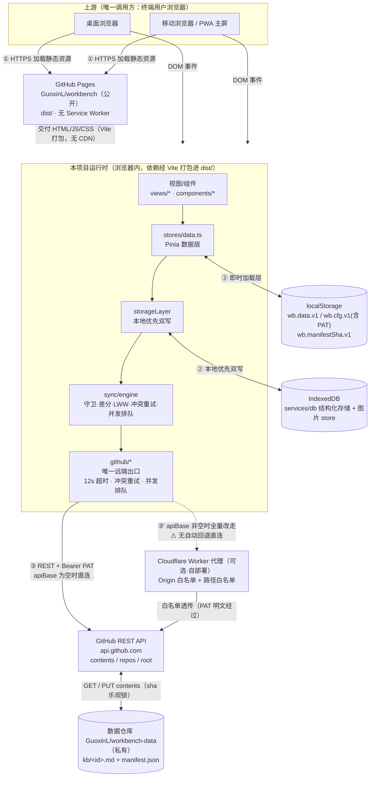

# 上下游 / 集成关系

> 本项目与外部世界的关系：谁在用它、它依赖了谁、依赖坏掉会怎样。
> 引入新外部依赖、调整调用拓扑、修改集成方式时同步更新。

> Source（以磁盘真实代码为准）：`src/services/github/*`（唯一外部 HTTP 出口）、`src/services/sync/engine.ts`（同步引擎）、`src/stores/data.ts`（Pinia 数据层）、`src/services/storage/storageLayer.ts`（本地优先双写）、`src/services/db/*`（IndexedDB）、`proxy/cloudflare-worker.js`（可选代理）、`vite.config.ts`、`.github/workflows/deploy.yml`
> Last-verified: 2026-08-04（分支 `feature/image-cloud-editor`，Vue3 + Vite + TS + Pinia 重构后）

> 架构侧的模块分层与数据流见 @`.harness/docs/architecture.md`（§2 系统上下文、§5 数据流、§6 服务通信、§9 横切关注点），本文件不复制，只补「外部依赖 + 失败传播」维度。

---

## 上游（谁在用本项目）

| 调用方 / 集成方 | 用途 | 协议 / 集成方式 | 关键入口 | 联系人 |
|-----------------|------|-----------------|---------|-------|
| 终端用户 · 桌面浏览器 | 打开工作台管理待办 / 文章 / 双链笔记 | HTTPS 加载静态页 + 浏览器 DOM 事件 | `index.html` → `src/main.ts`（`createApp`）→ `src/App.vue` | Guoxin.Liu <lgx31@sina.cn> |
| 终端用户 · 移动浏览器 / 「添加到主屏幕」PWA | 同上，移动端以独立窗口打开 | HTTPS + PWA manifest | 同上；主屏图标经 GitHub Pages 提供的 manifest | 同上 |

**上游侧结论（已核实）**：

- **无任何服务端调用方**：全仓库无 HTTP/gRPC 服务端入口、无路由注册、无 WebHook 接收端、无消息消费者（`architecture.md` §1）。
- **不被其它仓库以包依赖方式引用**：作为静态站点部署，无发布到 npm 的库形态。
- **无鉴权 / 无多租户**：应用自身无登录态，任何人打开页面都是「空白本地模式」；数据可见性完全由使用者自己的 PAT 与私有数据仓库决定。
- 上游只有「终端用户浏览器」一类，且**同一使用者的多台设备互为并发写入方**——这是 LWW 合并与 sha 乐观锁存在的唯一原因（`src/services/sync/merge.ts`、`src/services/github/contents.ts`）。

---

## 下游（本项目用了谁）

| # | 被调方 | 用途 | 协议 / 集成方式 | 关键入口 | 失败处理 |
|---|-------|------|-----------------|---------|---------|
| 1 | **GitHub REST API**（`api.github.com`） | 唯一持久化后端：读写 `kb/<id>.md` + `manifest.json`；图云经 `images/<hash>.<ext>`；连接测试；令牌 / 限流诊断 | HTTPS REST，`Authorization: Bearer <PAT>`，`Accept: application/vnd.github+json` | ① `GET /repos/{o}/{r}/contents/manifest.json?ref={branch}` ② `GET/PUT /repos/{o}/{r}/contents/kb/{id}.md`（按差分 id） ③ `PUT /repos/{o}/{r}/contents/images/{hash}.{ext}`（图云同步模式） ④ `GET /repos/{o}/{r}`（校验 `permissions.push`） ⑤ `GET /`（连通性探测） | **超时**：统一 12s `AbortController`（`diagnose.ts`）；**重试**：仅 PUT 遇 409 / `conflictSlug` 冲突重试（上限 `MAX_RETRY`，退避 `RETRY_BACKOFF×attempt`，`sync/engine.ts`）；**降级**：无自动降级，整轮 `doSync` 进入 `error` 态，本地数据仍完整可用 |
| 2 | **数据仓库 `GuoxinL/workbench-data`** | 存放 `kb/<id>.md`（文章正文 + frontmatter）+ `manifest.json`（轻量索引）；每次推送产生一次 commit | 经上面 ①/②/③ 间接访问，**不直连 git** | 默认值来自 `Config`（可在设置抽屉覆盖）；键 `wb.cfg.v1` | 文件不存在（GET 404）→ 视为「首次」，无 sha 的 PUT 自动创建；内容非法 JSON → 引擎 `catch` 置 `error`，**无降级**（需人工修远端） |
| 3 | **Cloudflare Worker 代理**（可选，使用者自部署） | 网络访问不了 `api.github.com` 时的中转 | HTTPS 反向代理，白名单透传 | 由 `cfg.apiBase` 激活：非空即替换 API 根地址；UI 在 `SettingsSheet.vue` | **无自动回退**：`apiBase` 非空即全量改走代理，代理挂掉不会回落官方地址，需人工清空该配置项 |
| 4 | **GitHub Pages** | 静态托管 = 唯一代码分发渠道 | HTTPS 静态交付（`dist/`，由 GitHub Actions 发布） | `git push main` → `.github/workflows/deploy.yml` 构建并发布 | **无降级**：Pages 不可用 = 应用打不开。**无 Service Worker**（全仓库无 `sw.js` / `serviceWorker` 注册），离线冷启动白屏 |
| 5 | **浏览器 `localStorage`** | 即时加载层（`wb.data.v1`）+ 配置（`wb.cfg.v1` 含 Token）+ 乐观锁 sha（`wb.manifestSha.v1`） | 同步 JS API | 键：`wb.data.v1` / `wb.cfg.v1` / `wb.manifestSha.v1`（`src/stores/data.ts:22-24`） | 写入有兜底（try/catch + 提示）；读取解析失败回落默认；容量上限约 5MB |
| 6 | **浏览器 `IndexedDB`** | 结构化存储层（`services/db`）+ 图片 store（图云极简模式） | 异步 API | `src/services/db/*` | 写入失败不应阻断本地；同步引擎异常被 `storageLayer` 吞掉只影响远端 |
| 7 | **浏览器平台 API** | 运行时刚性前提 | 原生 API | `fetch` + `AbortController`、`structuredClone`、DOM、ESM（Vite 构建产物） | 现代浏览器前提；无 polyfill |
| 8 | **npm 依赖（构建期）** | Vue3 / Vite / Pinia / Element Plus / @milkdown/kit / dompurify / idb / marked / zod 等 | 构建期打包，运行时随 `dist/` 交付 | `package.json` | 构建失败阻断发布（CI 拦截） |

> **构建期依赖 ≠ 运行时外部依赖**：依赖在构建期经 Vite 打包进 `dist/`，运行时不再外链 CDN，故 CDN 故障对运行时**零影响**。这与早期「零依赖手写」架构不同——当前为有构建流水线的标准前端工程（AGENTS.md 红线 2/3 已作废）。

---

## 调用关系说明

### 1. 首屏加载与代码分发（浏览器 ← GitHub Pages / Actions）

- **触发场景**：使用者打开 `https://guoxinl.github.io/workbench/` 或点击手机主屏图标。
- **调用拓扑**：`浏览器` ─→ `GitHub Pages CDN` ─→ 交付 `index.html` + `assets/index-<hash>.js`（Vite 内容 hash）+ `assets/index-<hash>.css`。
- **传输数据**：纯静态资源，**不含任何凭证**；缓存失效由 Vite 产物内容 hash 保证（**无 `?v=` 参数、无 `bump-version.sh`**）。
- **失败影响**：Pages 不可用 → 应用完全打不开（无 Service Worker 兜底）。

### 2. 本地写入 → 防抖推送到 GitHub（核心写链路）

- **触发场景**：新建 / 编辑 / 删除待办或文章、粘贴图片等**任何**数据变更。
- **调用拓扑**：`视图/组件` ─→ `stores/data.ts` mutator ─→ `storageLayer.Save*()` ─→ **先写 IndexedDB（毫秒级、离线可用）** + 触发 `sync/engine.schedulePush()`（防抖）─→ `doSync()` ─→ **[可选 Worker]** ─→ `GitHub Contents API` ─→ `workbench-data` 仓库。
- **传输数据**：`kb/<id>.md`（frontmatter + Markdown 正文）；`manifest.json` 为轻量索引；**Token 只在 `Authorization` 头中，绝不在 body 内**（红线 5）。
- **失败影响**：推送失败**不丢本地数据**——同步进入 `error` 态（SyncChip 红点），但本地 IndexedDB + `wb.data.v1` 完整；`dirty` 语义由引擎在下轮重试。跨设备一致性暂时中断。

### 3. 拉取与合并（多条触发路径汇入同一入口）

- **触发场景**：① 定时轮询（间隔 `cfg.poll`，默认 5s，钳制 5–300s，`document.hidden` 时跳过）；② 回到前台 `visibilitychange` / 网络恢复 `online`；③ 手动点顶栏同步胶囊（非静默同步 + 提示）。
- **调用拓扑**：`触发源` ─→ `engine.sync()` ─→ `contents.fetchManifest()`（轻量 GET）─→ `planDiff` 按 id 算 pull/push ─→ `fetchArticles/fetchTodos`（仅差分）─→ `mergeArticles/mergeTodos`（逐条 LWW）─→ `applyRemote` 写回本地 ─→ 有领先变更才 `pushRemote`。
- **合并语义**：以 `id` 为主键，仅当 `remote.updatedAt > local.updatedAt` 才覆盖；软删墓碑保证删除传播（`sync/serialize.ts` 的 `cleanupTombstones`）。

### 4. 冲突重试（sha 乐观锁）

- **触发场景**：两台设备几乎同时提交，PUT 时 `sha` 已过期。
- **调用拓扑**：`pushRemote` ─→ 409 / `conflictSlug` ─→ 退避 `RETRY_BACKOFF × attempt` ─→ 用刚拉到的远端 manifest sha 重拉合并后重试（**最多 `MAX_RETRY` 轮**）。
- **关键**：必须用**刚拉取到的远端 manifest sha**（非本地陈旧 sha）作乐观锁基准，否则重试循环每次重拉后仍用旧 sha → 死循环 → 同步失败（`sync/engine.ts:129-149` 注释）。
- **失败影响**：耗尽重试 → 本轮 `error`，`dirty` 仍为 `true`，下次触发会重新尝试，**数据不丢**。

### 5. 连接测试与五步诊断（排障手段）

- **触发场景**：设置抽屉点「测试连接」或「诊断」。
- **调用拓扑**：`SettingsSheet` ─→ `diagnose.testConnection()` / `diagnose.runDiagnose()` ─→ 依次：配置检查 → `GET /`（网络连通）→ 令牌有效性 → 仓库写权限（`permissions.push`）→ 数据文件（`manifest.json`，404 视为未创建）＋可选公开库 `workbench-public` 检查。
- **设计要点**：**任一步失败即中断并给出具体处置建议**；**配置不完整时 `testConnection` 直接返回友好提示、不发任何请求、不置「同步失败」**（回归红线，见 `verification.md` §7）。

### 6. 经 Cloudflare Worker 代理的中转链路（可选）

- **触发场景**：使用者在设置里填了「API 代理地址」（`cfg.apiBase` 非空）。
- **调用拓扑**：`github/*` ─→ `https://<你的>.workers.dev/...` ─→ **Origin 白名单** ─→ **路径白名单**（含 `/repos/{o}/{r}/contents/**`）─→ 透传必要头 ─→ `api.github.com` ─→ 原样回传 + 覆写 CORS 头。
- **传输数据**：**含 `Authorization: Bearer <PAT>` 明文经过 Worker**（唯一安全暴露点）；Worker 自身不存储不记录令牌。
- **失败影响**：**代理是单点且无自动回退**——一旦填了 `apiBase`，所有端点改走它，代理挂掉 = 同步中断，且前端不会尝试直连官方地址。

### 7. 图云上传（P2 ⑥）

- **触发场景**：编辑器粘贴/拖拽图片。
- **调用拓扑**：`MilkdownEditor`(`pasteImagePlugin`) ─→ `stores/data.ts.uploadImage(blob)` ─→ `services/image` 的 `createImageCloudLayer` ─→ 按 `isConfigComplete(cfg)` 路由：配置完整走 `gitCloud.pushImage`（`PUT images/<hash>.<ext>`，返回 `images/<hash>.<ext>` 键）/ 否则走 `localCloud`（IndexedDB 图片 store，`local-img:<sha>` 键）。
- **协调**：`storageLayer.Save*` 内部对正文做图云协调——把内嵌 `data:` 临时图替换为引用 key（幂等）+ 孤儿回收；`ShareView` / `lib/markdown` 的 `resolveImage` 把 git 键改写为 `raw.githubusercontent.com` 直链渲染。

### 8. 导出备份（纯本地，无下游）

- **触发场景**：设置抽屉点「导出备份」。
- **调用拓扑**：`stores/data.ts` ─→ 序列化 `wb.data.v1` ─→ `Blob` + `URL.createObjectURL` ─→ 浏览器下载。
- **失败影响**：无外部依赖，**GitHub 完全不可用时这条链路仍然可用**，是数据抢救的最后手段。

---

## 拓扑图

**强依赖判定**（缺失即核心功能不可用）：

| 依赖 | 强度 | 理由 |
|------|------|------|
| GitHub Pages | **强（首屏）** | 唯一代码分发渠道，无 SW 缓存，不可达即白屏 |
| localStorage / IndexedDB | **强（全程）** | 本地持久化，不可写则刷新即丢数据（IndexedDB 不可写仅影响同步远端） |
| 浏览器平台 API | **强（全程）** | ESM / fetch / AbortController 等现代浏览器前提 |
| GitHub REST API | **弱（可降级）** | 不可达时自动退化为功能完整的「本地模式」（`off` 态） |
| 数据仓库 | 弱（随 API） | 同上 |
| Cloudflare Worker | **条件强** | 未配置 `apiBase` 时完全无关；一旦配置即成为同步链路单点，且**无自动回退** |
| 外部 CDN | **无** | 运行时零外链（依赖已打包进 dist/） |

---

## 故障传播矩阵

> **填写口径**：「降级方案」列必须指向真实 fallback 代码；确实没有兜底的场景一律写「**无降级**」并写清用户可见表现，不得臆造。

| # | 下游 / 外部条件 | 受影响功能 | 失败表现（用户可见） | 是否可降级 | 降级 / 兜底方案 |
|---|----------------|-----------|---------|-----------|----------------|
| F1 | **`api.github.com` 网络不可达** | 仅「与 GitHub 同步」 | 顶栏红点「同步失败」/ 诊断网络步骤失败；`diagnose.ts` 给出「代理不可达 / CORS 拦截」或「直连不可达，请填 API 代理地址」提示 | ✅ 可降级 | 自动：`fetch` 网络错误 → `testConnection` 中文化提示（区分代理/直连，`diagnose.ts:62-66`）；本地待办 / 文章 **全部照常**（`storageLayer` 仅落本地），`dirty` 保持待推；网络恢复 `online` 事件自动重试 |
| F2 | **请求超时 >12s** | 同步 | 红点 + 超时提示 | ✅ 可降级 | `AbortController` 12s 硬超时（`diagnose.ts`） |
| F3 | **Token 无效 / 过期（401）** | 同步、测试、诊断 | 红点；诊断「令牌失效或无效」 | ✅ 可降级（本地不受影响） | 状态码映射 `code:'token'`（`diagnose.ts:70`）；无自动刷新 PAT，需人工换令牌；本地数据完整 |
| F4 | **Token 无写权限** | 推送（PUT） | 「测试连接」返回「令牌缺少仓库写权限（需 repo 权限）」；诊断第 4 步提示 | ⚠️ 部分降级 | `testConnection` 校验 `canPush`（`diagnose.ts:73,101-105`）；`doSync` 推送遇 403 走 error 分支 |
| F5 | **仓库 / 分支不存在或令牌未授权（404）** | 同步 | 红点 + 404 提示；诊断第 4 步细粒度提示 | ✅ 可降级 | `code:'notfound'`（`diagnose.ts:70`）；配置留空时有 `isConfigComplete` 守卫避免空配置发起请求 |
| F6 | **API 频率超限（403/429 `ratelimit`）** | 同步 | 红点 + 限流提示 | ⚠️ 部分降级 | `code:'ratelimit'`（`diagnose.ts:70`）；无退避/熔断；轮询仍继续。预防靠轮询间隔下限 5s + 推送防抖 + `document.hidden` 跳过 |
| F7 | **`429 Too Many Requests`** | 同步 | 红点 + 限流提示（已中文化为 `ratelimit`） | ⚠️ 部分降级 | `readErr` 映射 403/429 → `ratelimit`（`diagnose.ts:70`）；无 `Retry-After` 解析、无退避 |
| F8 | **PUT 冲突 409 / `conflictSlug`** | 单次推送 | **通常用户无感知**（静默重试后成功） | ✅ 可降级（唯一有重试的场景） | 识别冲突 → 退避 `RETRY_BACKOFF × attempt` → 用刚拉到的远端 sha 重拉合并 → 再 PUT，最多 `MAX_RETRY` 轮（`sync/engine.ts`） |
| F9 | **连续 `MAX_RETRY` 轮冲突全败** | 本次同步 | 红点 + error | ✅ 可降级 | 抛错走 `catch` → `setPhase('error')`（`sync/engine.ts:155-158`）。**数据不丢**：下次触发重新尝试 |
| F10 | **远端 `manifest.json` / `kb/<id>.md` 不是合法内容**（被人工误改） | 同步（拉取即中断） | 红点 + 解析/校验失败 | ❌ 无降级 | 引擎 `catch` 置 `error`；本地变更无法上行，直到人工修好远端。兜底：用「导出备份」保住本地数据 |
| F11 | **远端 manifest 尚未创建（GET 404）** | 无（正常首次场景） | 无异常；诊断提示「尚未创建，首次同步会自动生成」 | ✅ 正常路径 | `fetchManifest` 返回 `null` → 视为首次，无 sha 的 PUT 自动创建（`github/contents.ts`、`github/manifest.ts`） |
| F12 | **Cloudflare Worker 代理下线**（`apiBase` 已配置） | 同步、测试、诊断——全部端点 | 红点 + 代理不可达提示 | ❌ 无自动降级 | `apiBase` 非空即全量改走代理，无健康检查无回落。恢复路径：设置清空「API 代理地址」。本地功能不受影响 |
| F13 | **Worker 拒绝：路径不在白名单（403）** | 对应端点 | 红点 + 白名单提示 | ❌ 无降级 | Worker `ALLOW` 正则拦截（含 `/repos/{o}/{r}/contents/**`，图云 `images/` 同属 contents 路径）；新增转发路径必须先加白名单 |
| F14 | **Worker 拒绝：Origin 不在白名单（403）**（如本地开发调代理） | 全部经代理请求 | 红点 + 来源未允许提示 | ❌ 无降级 | `ALLOW_ORIGINS` 默认仅放行 `https://guoxinl.github.io`；本地开发需把 origin 加进 Worker 白名单 |
| F15 | **Worker 上游中转失败（502）** | 同步 | 红点 + 中转失败提示 | ❌ 无降级 | Worker catch 返回 502 + JSON；前端展示 message，不重试不回落直连 |
| F16 | **GitHub 服务整体故障（5xx）** | 同步 | 红点 + 提示 | ⚠️ 部分降级 | 无 5xx 专门映射；下次轮询自然重试。本地功能不受影响 |
| F17 | **GitHub Pages 不可用 / 仓库转私有 / 部署被删** | **全部功能** | 页面打不开（白屏） | ❌ 无降级 | **无 Service Worker**，无离线缓存兜底。localStorage/IndexedDB 数据仍在，但无界面可读 |
| F18 | **浏览器断网（应用已加载）** | 仅同步 | 顶栏红点「同步失败」 | ✅ 可降级（最完整的降级路径） | 待办 / 文章 / 双链 / 编辑器**全部功能可用**；变更落 IndexedDB + `wb.data.v1` 并标记待推。网络恢复 `online` 自动补推 |
| F19 | **断网冷启动** | **全部功能** | 白屏 | ❌ 无降级 | 同 F17：无 SW，静态资源无法从缓存加载 |
| F20 | **IndexedDB / localStorage 写入失败**（配额耗尽 / 隐私模式） | 数据持久化 | 提示「本地存储写入失败」或静默 | ⚠️ 部分降级 | `storageLayer`/`store` 写入有 try/catch 兜底；同步异常被吞掉只影响远端 |
| F21 | **localStorage 被清空**（清数据 / 换设备） | 本地数据 + 同步配置（含 Token） | 打开是全新空白工作台 | ✅ 可降级（前提同步曾成功） | `loadData()` 读不到即回落空数据 / 默认配置（`stores/data.ts`）；重填仓库与 Token 后首次同步把远端合并回本地。若从未配过同步 = 数据永久丢失 |
| F22 | **未配置同步 / `enabled=false` / 配置不完整**（正常初始状态） | 仅同步 | 顶栏灰点「本地模式」 | ✅ 设计内的降级（默认形态） | `isEnabled()===false` 或 `!isConfigComplete(cfg)` → `engine.doSync` 直接 `setPhase('off')` 并 return，**不发请求、不报「同步失败」**（`sync/engine.ts:82-90`）；所有业务功能 100% 可用 |

### 无降级场景汇总

| 风险 | 场景 | 核心问题 | 建议 |
|------|------|---------|------|
| 🔴 | **F17 / F19 GitHub Pages 不可用 · 离线冷启动** | 无 Service Worker，数据在本地却无界面可读 | 补 SW 做静态资源缓存（需先解决与 Vite 内容 hash 的协同） |
| 🔴 | **F10 远端内容损坏** | 拉取即抛错，本地变更无法上行 | 至少给出「导出备份 + 强制覆盖远端」的人工逃生入口 |
| 🟡 | **F12 代理挂掉无法回退直连** | `apiBase` 一旦配置即成单点，无健康检查无回落 | 代理连续失败 N 次后提示「是否临时改用官方地址」 |
| 🟡 | **F7 `429` 未充分处理** | 无 `Retry-After` 解析、无退避 | 在诊断/引擎补 429 分支 + 限流期间暂停轮询 |
| 🟢 | **F13 / F14 / F15 Worker 三类拒绝/失败** | 均需改 Worker 并重新部署 | 属可接受设计（白名单是安全特性）；文案已足够定位 |

> **一条贯穿全表的结论**：本项目的降级模型极其干净——**所有 GitHub 侧故障（F1–F11、F16）都统一退化为「功能完整的本地模式」**（`off`/`error` 态，业务逻辑零网络依赖，数据层完全自洽于 `stores/data.ts` + `services/db`）。真正会造成用户不可用的，只有**代码分发层（F17/F19）**与**本地存储层（F20/F21）**这两处，且都缺少兜底。
