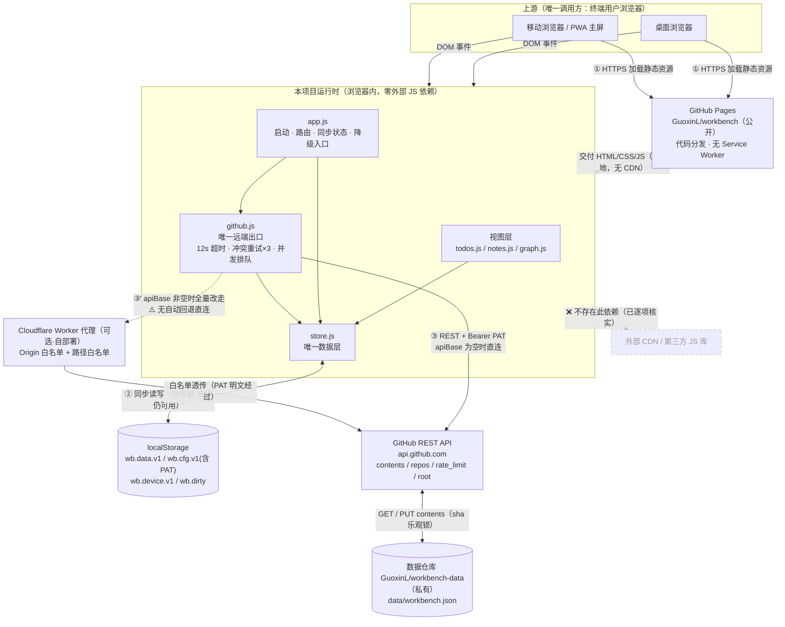

# 上下游 / 集成关系

> 本项目与外部世界的关系：谁在用它、它依赖了谁、依赖坏掉会怎样。
> 引入新外部依赖、调整调用拓扑、修改集成方式时同步更新。

> Source: `index.html`（全部 `<link>` / `<script>` 引用）、`js/github.js`（唯一外部 HTTP 出口）、`js/store.js`（唯一本地持久化出口）、`js/app.js`（生命周期与降级入口）、`proxy/cloudflare-worker.js`、`css/style.css`、`manifest.json`、`README.md`
> Last-verified: 2026-07-31（对应 commit `cf46195`，分支 `main`）

> 架构侧的模块分层与数据流见 @`.harness/docs/architecture.md`（§2 系统上下文、§6 服务通信、§9 横切关注点），本文件不复制，只补「外部依赖 + 失败传播」维度。
> 迁移状态：`no-migration(no legacy dependency-map.md)` —— 全仓库无旧版 `dependency-map.md` 残留（`find . -name dependency-map.md` 无命中）。

---

## 上游（谁在用本项目）

| 调用方 / 集成方 | 代码仓库 | 用途 | 协议 / 集成方式 | 关键入口 | 联系人 |
|-----------------|---------|------|-----------------|---------|-------|
| 终端用户 · 桌面浏览器 | —（人工使用，非代码调用方） | 打开工作台管理待办 / 笔记 / 图谱 | HTTPS 加载静态页 + 浏览器 DOM 事件 | `index.html` → `js/app.js:290-291`（`DOMContentLoaded` → `boot()`） | Guoxin.Liu <lgx31@sina.cn> |
| 终端用户 · 移动浏览器 / 「添加到主屏幕」PWA | — | 同上，移动端以独立窗口（`display: standalone`）打开 | HTTPS + PWA manifest（`manifest.json:5-7`，`start_url: ./index.html`） | 同上；移动端专用导航 `index.html:146-159` → `js/app.js:63-65` | 同上 |

**上游侧结论（已核实）**：

- **无任何服务端调用方**：全仓库无 HTTP/gRPC 服务端入口、无路由注册、无 WebHook 接收端、无消息消费者（`architecture.md` §1 判定证据表）。
- **不被其它仓库以包依赖方式引用**：无 `package.json` / 无发布产物；8 个 JS 文件挂在 `window.WB` 全局命名空间（`js/util.js:4`），只能整站加载，不可作为库被 import。
- **无鉴权 / 无多租户**：应用自身无登录态，任何人打开页面都是「空白本地模式」；数据可见性完全由使用者自己的 PAT 与私有数据仓库决定。
- 因此上游只有「终端用户浏览器」一类，且**同一使用者的多台设备互为并发写入方**——这是 LWW 合并与 sha 乐观锁存在的唯一原因（`js/store.js:265-294`、`js/github.js:131`）。

> **集成方式说明**：本项目对上游不提供任何编程接口，唯一「契约」是浏览器需支持 `fetch` / `AbortController` / `TextEncoder` / `localStorage` / 内联 SVG（见下游表最后一行）。

---

## 下游（本项目用了谁）

| # | 被调方 / 被依赖方 | 代码仓库 | 用途 | 协议 / 集成方式 | 关键入口 | SLA / 版本约束 | 失败处理（超时 / 重试 / 降级）| 集成代码位置 |
|---|-------------------|---------|------|-----------------|---------|---------------|------------------------------|--------------|
| 1 | **GitHub REST API**（`api.github.com`） | 外部 SaaS，无源码 | 唯一持久化后端：读写 `data/workbench.json`；连接测试；令牌 / 限流诊断 | HTTPS REST，`Authorization: Bearer <PAT>`，`Accept: application/vnd.github+json` | ① `GET /repos/{owner}/{repo}/contents/{path}?ref={branch}&t={ts}`（`js/github.js:106-109`） ② `PUT /repos/{owner}/{repo}/contents/{path}`（带 `sha` 乐观锁，`js/github.js:125-137`） ③ `GET /repos/{owner}/{repo}`（校验 `permissions.push`，`js/github.js:261`、`js/github.js:335`） ④ `GET /rate_limit`（读 `x-oauth-scopes`，`js/github.js:321`） ⑤ `GET /`（纯连通性探测，不带 token，`js/github.js:307`） | API 版本头钉死 `X-GitHub-Api-Version: 2022-11-28`（`js/github.js:58`）；认证配额 **5000 次/小时**（`README.md:110`）；Contents API 单文件上限 100MB（未在代码中校验） | **超时**：统一 12s `AbortController`，诊断步骤 10s（`js/github.js:67-91`、`js/github.js:307,321,335`） **重试**：仅 `PUT` 遇 409/422 冲突重试，最多 3 次，退避 `350ms × attempt`（`js/github.js:139-143,192-197`）；**GET 失败、401/403/404/429/5xx 一律不重试** **降级**：无自动降级，整次 `sync()` 返回 `false` → `setState('error')` 红点（`js/github.js:201-206`）；数据仍完整可用于本地 | `js/github.js` 全文（唯一出口，AGENTS.md 红线 4） |
| 2 | **数据仓库 `GuoxinL/workbench-data`** | `github.com/GuoxinL/workbench-data`（**私有**，`README.md:59-60`） | 存放唯一数据文件 `data/workbench.json`；每次同步产生一次 commit，白拿版本历史 | 经上面 ①② 间接访问，**不直连 git** | 默认值 `js/store.js:33-35`（`repo`/`branch`/`path`），可在设置面板覆盖（`index.html:219-232`） | 仓库名 / 分支 / 路径允许留空，**加载侧 + 引擎侧双重回落**默认值（`js/store.js:74-77`、`js/github.js:34-41`） | 文件不存在（GET 404）→ 不报错，视为「首次」，`needPush=true` 走无 `sha` 的 PUT 自动创建（`js/github.js:111,169`） 文件内容非法 JSON → 抛错中断本次同步，**无降级**（`js/github.js:116-120`） | `js/github.js:48-52`（`apiUrl` 拼装） |
| 3 | **Cloudflare Worker 代理**（可选，使用者自部署） | 脚本随仓提供：`proxy/cloudflare-worker.js`（部署到使用者自己的 Cloudflare 账号） | 网络访问不了 `api.github.com` 时的中转（`README.md:115`） | HTTPS 反向代理，白名单透传 | 由配置项 `cfg.apiBase` 激活：非空即替换 API 根地址（`js/github.js:14-18`）；UI 入口 `index.html:237-243` | 路径白名单 4 条正则（`proxy/cloudflare-worker.js:20-25`）；Origin 白名单默认仅 `https://guoxinl.github.io`（`proxy/cloudflare-worker.js:29-31`）；透传请求头仅 4 个（`proxy/cloudflare-worker.js:74`）；暴露响应头含 `x-oauth-scopes`（`proxy/cloudflare-worker.js:39`，诊断步骤 3 依赖它） | **无自动回退**：`API_BASE()` 只看 `cfg.apiBase` 是否为空字符串，**代理挂掉不会回落到 `api.github.com`**（`js/github.js:14-18`），必须人工清空该配置项 Worker 侧中转失败返回 502 + JSON `{message}`（`proxy/cloudflare-worker.js:88-93`），前端经 `readErr()` 显示该 message（`js/github.js:93-103`） | `js/github.js:11-18`、`proxy/cloudflare-worker.js` |
| 4 | **GitHub Pages** | `github.com/GuoxinL/workbench`（**必须公开**） | 静态托管 = 唯一代码分发渠道，`https://guoxinl.github.io/workbench/` | HTTPS 静态交付；`main` 分支 root 目录，`.nojekyll` 关闭 Jekyll | `git push` 后自动发布（无 CI 流水线，`architecture.md` §8） | 全站相对路径，无需 base 配置（`README.md:52`）；缓存刷新靠 `?v=<时间戳>`（`index.html:14,269-276`）+ 三个防缓存 meta（`index.html:5-7`） | **无降级**：Pages 不可用 = 应用完全打不开。**无 Service Worker**（全仓库无 `sw.js` / `serviceWorker` 注册），离线冷启动白屏（`architecture.md` §12 已列为技术债） | 仓库根目录全部静态文件 |
| 5 | **浏览器 `localStorage`** | 浏览器平台能力 | 本地唯一持久化，兼作离线存储与「本地模式」的完整后端 | 同步 JS API | 键：`wb.data.v1` / `wb.cfg.v1`（含 Token）/ `wb.device.v1` / `wb.dirty`（`js/store.js:10-12,84`）；另有 UI 态 `wb.view` / `wb.seeded` 由 `app.js` 直写（`js/app.js:22,24,73,79`，`architecture.md` §12 已记为技术债） | 容量上限约 5MB；同源隔离；隐私模式 / 禁用 Cookie 时可能不可写 | **数据写入**有兜底：`saveLocal()` try/catch → toast 报错（`js/store.js:87-94`） **读取解析失败**有兜底：`loadLocal()` try/catch + `console.warn`，回落到空数据 / 默认配置（`js/store.js:63-77`） **⚠️ 三处 setItem 无保护**：`setDirty()`（`js/store.js:331`）、`wb.seeded`（`js/app.js:24`）、`wb.view`（`js/app.js:73`）未包 try/catch，配额耗尽时会抛未捕获异常 **⚠️ 一处静默吞异常**：`saveCfg()` 的 catch 为空块（`js/store.js:98`），Token 保存失败用户无感知 | `js/store.js`（唯一出口，AGENTS.md 红线 4） |
| 6 | **浏览器平台 API** | 浏览器平台能力 | 运行时刚性前提 | 原生 API | `fetch` + `AbortController`（`js/github.js:69-72`）、`TextEncoder`/`TextDecoder` + `btoa`/`atob`（`js/util.js:86-101`）、内联 SVG（`js/graph.js`）、`document.hidden`（`js/github.js:246`）、`online` / `visibilitychange` / `beforeunload`（`js/app.js:44-48`） | 需现代浏览器（ES2017+ `async/await`、可选链未使用）；无 polyfill、无 Babel、无 browserslist 配置 | **无降级、无特性探测**：任一 API 缺失即启动崩溃 | `js/util.js`、`js/github.js`、`js/app.js` |
| 7 | **前端 CDN / 第三方 JS/CSS 库** | — | — | — | — | — | **✅ 已核实为零**（见下方专项核实） | — |

### 7 号行专项核实：确认零外部前端依赖

逐项核对，**未发现任何外部资源引用**，本项目对 CDN 的可用性无任何暴露：

| 核实对象 | 方法 | 结论 |
|---------|------|------|
| `index.html` 的 8 个 `<script>` | 逐行读 `index.html:269-276` | 全部为 `js/*.js?v=…` **本地相对路径**，无一条指向 CDN |
| `index.html` 的 `<link>` | `index.html:14-17` | `css/style.css?v=…`、`manifest.json`、`icon.svg`（×2）——全部本地 |
| CSS 内外部引用 | 在 `css/style.css` 检索 `@import` / `http` | **0 命中**，无外部样式表、无远程字体文件 |
| 字体 | `css/style.css:22-24` | 纯系统字体栈（`-apple-system` / `PingFang SC` / `ui-monospace` …），**无 Google Fonts 等 webfont** |
| PWA 图标 | `manifest.json:10-12` | 仅 `icon.svg`，本地文件 |
| Markdown 渲染 | `js/markdown.js` 203 行手写 | 未引 marked / markdown-it / DOMPurify（`js/markdown.js:3-4` 注释说明动机） |
| 图谱布局 | `js/graph.js` 202 行手写 | 未引 d3-force / cytoscape（`js/graph.js:2` 注释「无依赖力导向布局」） |
| 包管理 | 全仓库 | 无 `package.json` / `node_modules` / lockfile（AGENTS.md 红线 2 明令禁止） |

> **结论**：CDN 故障对本项目**零影响**。这不是巧合而是被 AGENTS.md 红线 2 强制保护的架构属性——任何新增 CDN 引用都会同时破坏「零构建直出 Pages」模型并新增一个不可控故障源，评审时应直接拒绝。

---

## 调用关系说明

### 1. 首屏加载与代码分发（浏览器 ← GitHub Pages）

- **触发场景**：使用者打开 `https://guoxinl.github.io/workbench/` 或点击手机主屏图标。
- **调用拓扑**：`浏览器` ─→ `GitHub Pages CDN` ─→ 交付 `index.html` + `css/style.css?v=` + 8 个 `js/*.js?v=`
- **传输数据**：纯静态资源，**不含任何凭证**；版本参数 `?v=20260730-2348` 由 `./bump-version.sh` 统一刷新。
- **关键代码**：`index.html:14,269-276`（加载顺序 `util → store → github → markdown → todos → notes → graph → app`，顺序即依赖顺序，不可调换）；`js/app.js:290-291` 触发 `boot()`。
- **失败影响**：Pages 不可用 → 应用完全打不开（无 Service Worker 兜底）。若某个 `js` 文件 404 或被旧缓存命中，会因全局命名空间缺失直接运行时崩溃——这正是 AGENTS.md 红线 3 存在的原因。
- **相关文档**：@`.harness/docs/devops/deployment.md`

### 2. 本地写入 → 防抖推送到 GitHub（核心写链路）

- **触发场景**：新建 / 编辑 / 删除待办或笔记等**任何**数据变更。
- **调用拓扑**：`视图层(todos/notes)` ─→ `store.commit()` ─→ `localStorage` ─→ `emit('change')` ─→ `app.js` ─→ `gh.schedulePush()`（防抖 1.5s）─→ `sync()` ─→ **[可选 Worker]** ─→ `GitHub Contents API` ─→ `workbench-data` 仓库
- **传输数据**：`store.serialize()` 的**全量** JSON（`{version, updatedAt, todos[], notes[]}`，已剔除 30 天前墓碑，`js/store.js:312-321`），Base64 编码后放进 PUT body；**Token 只在 `Authorization` 头中，绝不在 body 内**（AGENTS.md 红线 5）。
- **关键代码**：`js/store.js:143-150`（commit）→ `js/app.js:27-30`（订阅）→ `js/github.js:237`（防抖）→ `js/github.js:220-232`（并发排队）→ `js/github.js:151-207`（runSync）→ `js/github.js:125-148`（pushRemote）。
- **失败影响**：推送失败**不丢本地数据**——`dirty` 保持 `true`（`js/store.js:145`），顶栏显示「待同步」/「同步失败」（`js/app.js:110-112`），关闭页面时 `beforeunload` 弹原生确认框拦截（`js/app.js:48-55`）。但**跨设备一致性中断**，另一台设备看不到本次变更。
- **相关文档**：`.harness/docs/apis/` 下暂无本项目对外接口文档（本项目不提供 API，只消费 GitHub API）。

### 3. 拉取与合并（三条触发路径汇入同一入口）

- **触发场景**：① 定时轮询（默认 20s，钳制 5–300s，`document.hidden` 时跳过，`js/github.js:240-249`）；② 回到前台 `visibilitychange` / 网络恢复 `online`（`js/app.js:44-47`）；③ 手动点顶栏同步胶囊（先 `WB.notes.flush()` 落盘再非静默同步，`js/app.js:95-99`）。
- **调用拓扑**：`触发源` ─→ `gh.sync({silent})` ─→ `GET contents` ─→ `store.mergeInto()` 逐条 LWW ─→ `emit('change')` ─→ 全量重渲染
- **传输数据**：GET 响应 `{content: base64, sha}`；合并以记录 `id` 为主键，仅当 `remote.updatedAt > local.updatedAt` 才覆盖（`js/store.js:265-294`）。
- **关键代码**：`js/github.js:106-122`（fetchRemote）、`js/store.js:265-294`（mergeInto）、`js/store.js:297-309`（diffFromRemote 决定是否需推）。
- **失败影响**：拉取失败 → 本地读写照常，仅收不到其它设备的更新；轮询会在下个周期继续重试（这也意味着**限流场景下轮询会持续加剧限流**，见故障矩阵 F6）。

### 4. 冲突重试（sha 乐观锁）

- **触发场景**：两台设备几乎同时提交，PUT 时 `sha` 已过期。
- **调用拓扑**：`pushRemote` ─→ `409/422` ─→ 退避 `350ms × attempt` ─→ 重新 `GET` + `mergeInto` ─→ 再 `PUT`（**最多 3 轮**）
- **关键代码**：`js/github.js:139-143`（识别冲突）、`js/github.js:192-197`（退避重试）、`js/github.js:200`（3 轮耗尽抛「多次提交冲突，已放弃本次同步」）。
- **失败影响**：3 轮全败 → 本次同步失败，`dirty` 仍为 `true`，下次触发（防抖 / 轮询 / 手动）会重新尝试，**数据不丢**。

### 5. 连接测试与五步诊断（替代链路追踪的排障手段）

- **触发场景**：设置面板点「测试连接」（`index.html:259`）或「诊断」（`index.html:258`）。
- **调用拓扑**：`app.js` ─→ `gh.test()` / `gh.diagnose()` ─→ 依次打 `GET /` → `GET /rate_limit` → `GET /repos/{o}/{r}` → `GET contents`
- **关键代码**：`js/github.js:252-281`（test）、`js/github.js:284-368`（diagnose 五步：配置检查 → 网络连通 → 令牌有效性 → 仓库访问与写权限 → 数据文件）；UI 渲染 `js/app.js:144-166`。
- **设计要点**：**任一步失败即中断并给出具体处置建议**（例如网络连通失败时直接提示「这是你同步失败的根因，需要填 API 代理地址」，`js/github.js:314`）；写权限在测试阶段前置校验 `permissions.push === false`（`js/github.js:265`、`js/github.js:342`）。
- **失败影响**：诊断本身失败不影响数据，只是排障能力下降。

### 6. 经 Cloudflare Worker 代理的中转链路（可选）

- **触发场景**：使用者在设置里填了「API 代理地址」（`cfg.apiBase` 非空）。
- **调用拓扑**：`js/github.js` ─→ `https://<你的>.workers.dev/...` ─→ **Origin 白名单校验** ─→ **路径白名单校验** ─→ 透传 4 个头 ─→ `api.github.com` ─→ 原样回传 + 覆写 CORS 头
- **传输数据**：**含 `Authorization: Bearer <PAT>` 明文经过 Worker**。这是本链路唯一的安全暴露点，`proxy/cloudflare-worker.js:5` 与 `index.html:241` 都明确警告「务必只填你自己搭建或完全信任的服务」；Worker 自身不存储不记录（`proxy/cloudflare-worker.js:72`）。
- **关键代码**：`js/github.js:14-18`（`API_BASE` 切换）、`proxy/cloudflare-worker.js:45-105`（完整转发逻辑）。
- **失败影响**：**代理是单点且无自动回退**——一旦填了 `apiBase`，所有 5 个端点全部改走它，代理挂掉 = 同步完全中断，且前端不会尝试直连官方地址（见故障矩阵 F12）。

### 7. 导出备份（纯本地，无下游）

- **触发场景**：设置面板点「导出备份」（`index.html:261`）。
- **调用拓扑**：`app.js` ─→ `store.serialize()` ─→ `Blob` + `URL.createObjectURL` ─→ 浏览器下载
- **关键代码**：`js/app.js:188-195`。
- **失败影响**：无外部依赖，**GitHub 完全不可用时这条链路仍然可用**，是数据抢救的最后手段（应写进故障应急预案）。

---

## 拓扑图

**强依赖判定**（缺失即核心功能不可用）：

| 依赖 | 强度 | 理由 |
|------|------|------|
| GitHub Pages | **强（首屏）** | 唯一代码分发渠道，无 SW 缓存，不可达即白屏 |
| localStorage | **强（全程）** | 唯一本地持久化，不可写则刷新即丢数据 |
| 浏览器平台 API | **强（全程）** | 无 polyfill、无特性探测 |
| GitHub REST API | **弱（可降级）** | 不可达时自动退化为功能完整的「本地模式」 |
| 数据仓库 | 弱（随 API） | 同上 |
| Cloudflare Worker | **条件强** | 未配置 `apiBase` 时完全无关；一旦配置即成为同步链路上的单点，且**无自动回退** |
| 外部 CDN | **无** | 零引用 |

---

## 故障传播矩阵

> **填写口径**：「降级方案」列必须指向真实 fallback 代码（`文件:行号`）；确实没有兜底的场景一律写「**无降级**」并写清用户可见表现，不得臆造。

| # | 下游 / 外部条件 | 受影响功能 | 失败表现（用户可见） | 是否可降级 | 降级 / 兜底方案（代码依据） |
|---|----------------|-----------|---------|-----------|----------------|
| F1 | **`api.github.com` 网络不可达**（DNS 失败 / 被阻断 / CORS 拒绝） | 仅「与 GitHub 同步」 | 顶栏红点「同步失败」；非静默调用弹 toast「无法连接 api.github.com：网络被阻断、域名解析失败或跨域被拒。若你所在网络访问不了 GitHub，请在设置里填写 API 代理地址」 | ✅ **可降级** | **自动**：`fetch` 抛 `TypeError` → 归一化为 `err.net=true` 中文提示（`js/github.js:79-86`）→ `setState('error')`（`js/github.js:201-206`）。待办 / 笔记 / 图谱的增删改查**全部照常**（全部走 `store.js` + localStorage），`dirty` 保持 `true`，网络恢复时 `online` 事件自动重试（`js/app.js:47`）。**人工**：设置里填 `apiBase` 改走代理（`js/github.js:14-18`） |
| F2 | **请求超时 >12s**（网络极慢 / 服务无响应） | 同步 | 红点 + toast「连接超时（12 秒未响应）：当前网络到 api.github.com 不通，建议在设置里填写 API 代理地址」 | ✅ 可降级 | `AbortController` 12s 硬超时，避免请求无限挂起（`js/github.js:67-91`）；诊断步骤缩短为 10s（`js/github.js:307,321,335`）。超时后同 F1 退回本地模式；下次轮询自动重试（`js/github.js:245-248`） |
| F3 | **Token 无效 / 过期（401）** | 同步、连接测试、诊断 | 红点「同步失败」；toast / 诊断第 3 步显示「Token 无效或已过期」（诊断文案额外提示「需重新生成」） | ✅ 可降级（本地功能不受影响） | 状态码映射 `readErr()`（`js/github.js:98`）、诊断专项判定（`js/github.js:322`）。**无自动刷新 Token 机制**（PAT 无 refresh 语义），需人工去设置面板换新令牌。本地数据完整保留，`dirty=true` 等换完令牌后自动补推 |
| F4 | **Token 无写权限**（`permissions.push === false`） | 推送（PUT）；拉取仍可能成功 | 「测试连接」返回「Token 对该仓库没有写入权限」；诊断第 4 步「能读取 xxx，但令牌没有写入权限（需 Contents: Read and write）」；实际同步时 PUT 返回 403/404 → 红点 | ⚠️ **部分降级** | 前置校验只在 `test()`（`js/github.js:265`）与 `diagnose()`（`js/github.js:342`）里做，**`runSync()` 不做前置校验**——正常同步路径下只能等 PUT 真失败才发现。本地功能不受影响 |
| F5 | **仓库 / 分支 / 路径不存在，或令牌未授权该仓库（404）** | 同步 | 红点 + toast「仓库或分支不存在，或 Token 无该仓库权限」；诊断第 4 步给出细粒度令牌需勾选 Repository access 的提示 | ✅ 可降级 | `readErr()` 404 映射（`js/github.js:100`）、诊断细化文案（`js/github.js:337`）。配置留空时有**双重回落**保护默认仓库（`js/store.js:74-77` + `js/github.js:34-41`），可避免「空配置指向空仓库」的历史故障 |
| F6 | **API 频率超限（403 + `rate limit`）** | 同步 | 红点 + toast「API 调用频率超限，请稍后再试」 | ⚠️ **部分降级** | 仅做文案映射（`js/github.js:99`），**无退避、无重试、无熔断**。轮询定时器**不会因限流暂停**（`js/github.js:245-248` 无条件继续），限流期间会持续打请求、延长恢复时间。现有的唯一预防措施是轮询间隔下限 5s（`js/github.js:244`）+ 推送防抖 1.5s（`js/github.js:237`）+ `document.hidden` 跳过（`js/github.js:246`）。本地功能不受影响 |
| F7 | **`429 Too Many Requests`** | 同步 | 红点 + toast 显示 GitHub 原始英文 `message`（未中文化） | ❌ **无降级** | `readErr()` **只处理 401/403/404**（`js/github.js:93-103`），429 落入默认分支：有 JSON body 时展示 `j.message`（英文原文），无 body 时展示 `429 Too Many Requests`。**无 `Retry-After` 解析、无退避、无重试**。用户看到一句看不懂的英文，唯一动作是等待或调大轮询间隔 |
| F8 | **PUT 冲突 409/422**（其它设备抢先提交） | 单次推送 | **通常用户无感知**（静默重试后成功） | ✅ **可降级（唯一有重试的场景）** | 识别冲突 `js/github.js:139-143` → 退避 `350ms × attempt` → 重新 `GET` + `mergeInto` LWW → 再 PUT，最多 3 轮（`js/github.js:156-199`）。这是全项目唯一的重试逻辑 |
| F9 | **连续 3 轮冲突全部失败** | 本次同步 | 红点 + toast「多次提交冲突，已放弃本次同步」 | ✅ 可降级 | 抛错后走统一错误分支（`js/github.js:200-206`）。**数据不丢**：`dirty` 仍为 `true`，下一次防抖推送 / 轮询 / 手动同步会重新尝试整个流程 |
| F10 | **远端 `data/workbench.json` 不是合法 JSON**（被人工误改 / 半截写入） | 同步（拉取即中断，**推送永远轮不到执行**） | 红点 + toast「远端数据文件不是合法 JSON，请检查 data/workbench.json」 | ❌ **无降级** | `JSON.parse` 失败直接抛错（`js/github.js:116-120`），**不会跳过合并直接覆盖推送**，也**无自动修复 / 无重命名坏文件重建**。后果：本地变更**永久无法上行**，直到人工去 GitHub 修好该文件；每次轮询都会重复报同一错误。**兜底手段**：用「导出备份」保住本地数据（`js/app.js:188-195`） |
| F11 | **远端数据文件尚未创建（GET 404）** | 无（这是正常首次场景） | 无异常；诊断第 5 步提示「尚未创建，首次同步会自动生成」 | ✅ 正常路径 | `fetchRemote` 返回 `{exists:false}` 而非抛错（`js/github.js:111`）→ `needPush=true`（`js/github.js:169`）→ PUT 不带 `sha` 自动创建文件（`js/github.js:131`） |
| F12 | **Cloudflare Worker 代理下线 / 未部署 / 域名被墙**（`apiBase` 已配置） | 同步、测试、诊断——**全部 5 个端点** | 红点 + toast「无法连接 xxx.workers.dev：网络被阻断、域名解析失败或跨域被拒…」 | ❌ **无自动降级** | `API_BASE()` 只判断 `cfg.apiBase` 是否为空串，**不做健康检查、不 catch 后回落官方地址**（`js/github.js:14-18`）。代理即单点。**唯一恢复路径是人工**：设置面板清空「API 代理地址」→ 保存（`js/app.js:235`、`js/app.js:168-186`）。本地数据与功能不受影响 |
| F13 | **Worker 拒绝：路径不在白名单（403）** | 对应端点（新增 GitHub 接口时最易踩） | 红点 + toast「该接口未在代理白名单内：/xxx」 | ❌ 无降级 | Worker 侧 `ALLOW` 正则拦截并返回 JSON（`proxy/cloudflare-worker.js:63-68`）；前端 `readErr()` 走默认分支展示该 `message`（`js/github.js:96-97`）。**修复必须改 Worker 代码并重新部署**——这也是 AGENTS.md 安全基线 3 的约束点：新增转发路径必须先加白名单 |
| F14 | **Worker 拒绝：Origin 不在白名单（403）**（如从 `localhost:8000` 本地开发调代理） | 全部经代理请求 | 红点 + toast「来源未被允许：http://localhost:8000」 | ❌ 无降级 | `ALLOW_ORIGINS` 默认只放行 `https://guoxinl.github.io`（`proxy/cloudflare-worker.js:29-31,55-60`）。本地开发若要用代理，需自行把 origin 加进 Worker 白名单后重新部署 |
| F15 | **Worker 上游中转失败（502）** —— Worker 活着但它连不上 GitHub | 同步 | 红点 + toast「中转到 GitHub 失败：<原始错误>」 | ❌ 无降级 | Worker catch 后返回 502 + JSON（`proxy/cloudflare-worker.js:88-93`）；前端展示 `j.message`（`js/github.js:96-97`），**不重试、不回落直连** |
| F16 | **GitHub 服务整体故障（5xx）** | 同步 | 红点 + toast 显示 GitHub 返回的 `message` 或 `5xx <statusText>` | ⚠️ 部分降级 | `readErr()` 无 5xx 专门映射（`js/github.js:93-103`），**无重试**；下次轮询自然重试。诊断第 2 步对 `>=500` 有专门文案「代理服务本身异常」（`js/github.js:308-311`）。本地功能不受影响 |
| F17 | **GitHub Pages 不可用 / 代码仓库被转为私有 / 部署被删** | **全部功能** | 页面打不开（404 或超时白屏）；手机主屏图标点开也是白屏 | ❌ **无降级** | **无 Service Worker**（全仓库无 `sw.js` / `serviceWorker` 注册），无离线缓存兜底。localStorage 里的数据仍在浏览器中，但**没有任何界面能读到它**。`architecture.md` §12 已把「有 manifest 无 SW」列为 🟡 中级技术债。唯一预防手段是平时用「导出备份」留本地 JSON |
| F18 | **浏览器断网（应用已加载）** | 仅同步 | 顶栏红点「同步失败」（网络错误文案同 F1） | ✅ **可降级（最完整的降级路径）** | 待办 / 笔记 / 图谱**全部功能可用**——增删改查、Markdown 渲染、双链解析、图谱布局全在本地完成，零网络依赖。变更持续落 localStorage（`js/store.js:87-94`）并置 `dirty`。**网络恢复自动补推**：`online` 事件立即触发静默同步（`js/app.js:47`），`visibilitychange` 回前台同样触发（`js/app.js:44-46`） |
| F19 | **断网状态下冷启动**（关掉页面后断网再打开） | **全部功能** | 白屏 | ❌ **无降级** | 同 F17：无 Service Worker，静态资源无法从缓存加载。**这是本项目最反直觉的缺陷**——数据本来就全在本地，离线可用性本应是天然优势，却因缺 SW 而完全不可用 |
| F20 | **localStorage 写入失败**（配额 5MB 耗尽 / Safari 隐私模式 / 禁用存储） | 数据持久化 | ⚠️ **表现不一致**：走 `saveLocal()` 的路径弹 toast「本地存储写入失败：<原因>」；走 `setDirty()` / `wb.view` / `wb.seeded` 的路径**抛未捕获异常**（控制台报错，行为不可预期） | ⚠️ **部分降级** | 有兜底：`saveLocal()` try/catch + toast（`js/store.js:87-94`）。**无兜底（3 处）**：`setDirty()`（`js/store.js:331`）、`js/app.js:24`、`js/app.js:73` 的 `setItem` 均未包 try/catch。**静默失败（1 处）**：`saveCfg()` 的 catch 是空块（`js/store.js:98`）——Token 保存失败用户完全无感知，下次打开发现「同步怎么没了」。数据仍在内存中可用，但**刷新即丢** |
| F21 | **localStorage 被清空**（清浏览器数据 / 换设备 / 无痕窗口） | 本地数据 + 同步配置（含 Token） | 打开是全新空白工作台；因 `wb.seeded` 也被清掉，会重新塞入示例数据（`js/app.js:22-25`） | ✅ 可降级（前提是同步曾成功） | `loadLocal()` 读不到即回落空数据 / 默认配置（`js/store.js:63-77`）。重新填好仓库与 Token 后，首次同步会把远端数据**合并**回本地（`js/github.js:164-166` → `js/store.js:265-294`，本地为空 → 远端记录全量插入）。**若从未配过同步 = 数据永久丢失**，无任何兜底 |
| F22 | **未配置同步 / `enabled=false` / 配置不完整**（正常的初始状态） | 仅同步 | 顶栏灰点「本地模式」；点同步胶囊会直接弹出设置面板 | ✅ **设计内的降级（默认形态）** | `cfgValid()` 不通过 → `setState('off')` 并立即返回（`js/github.js:222`、`js/github.js:243`）；`app.js` 启动时同样判定（`js/app.js:36-41`）；保存配置时若关闭同步会 toast「已切换为本地模式，数据仅保存在本机」（`js/app.js:182-185`）；点胶囊转为打开设置（`js/app.js:96`）。**所有业务功能 100% 可用**，这是本项目的完整离线形态 |

### 无降级场景汇总（7 类，按风险排序）

| 风险 | 场景 | 核心问题 | 建议 |
|------|------|---------|------|
| 🔴 | **F17 / F19 GitHub Pages 不可用 · 离线冷启动** | 无 Service Worker，数据在本地却无界面可读 | 补 SW 做静态资源缓存（需先解决与 `?v=` 版本参数的冲突，见 `architecture.md` §12） |
| 🔴 | **F10 远端 JSON 损坏** | 拉取即抛错，本地变更永久无法上行，每轮轮询重复失败 | 至少给出「导出备份 + 强制覆盖远端」的人工逃生入口 |
| 🟡 | **F12 代理挂掉无法回退直连** | `apiBase` 一旦配置即成单点，无健康检查无回落 | 可考虑：代理连续失败 N 次后提示「是否临时改用官方地址」 |
| 🟡 | **F20 localStorage 写入失败的 3 处裸 `setItem` + 1 处静默吞异常** | 表现不一致；Token 保存失败无感知 | 统一收敛到带 try/catch 的写入函数，`saveCfg()` 的空 catch 至少补 toast |
| 🟡 | **F7 `429` 未处理** | 无 `Retry-After` 解析、无退避，用户看到英文原文 | 在 `readErr()` 补 429 分支 + 限流期间暂停轮询 |
| 🟢 | **F13 / F14 / F15 Worker 三类拒绝/失败** | 均需改 Worker 并重新部署，前端只能透传报错 | 属可接受设计（白名单是安全特性）；文案已足够定位 |
| 🟢 | **依赖 6 浏览器平台 API 缺失** | 无特性探测、无 polyfill，直接崩溃 | 现代浏览器场景下可接受，不建议为此引入 polyfill（违反红线 2） |

> **一条贯穿全表的结论**：本项目的降级模型极其干净——**所有 GitHub 侧故障（F1–F11、F16）都统一退化为「功能完整的本地模式」**，因为业务逻辑零网络依赖、数据层完全自洽（`js/store.js`）。真正会造成用户不可用的，只有**代码分发层（F17/F19）**与**本地存储层（F20/F21）**这两处，且都缺少兜底。
